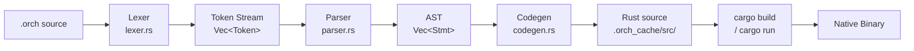

# Orchestrate Documentation

Orchestrate (`.orch`) is a compiled, asynchronous-first language for writing concurrent system coordinators. It compiles directly to native Rust and runs on the Tokio runtime — giving you native machine speed with zero interpreter overhead.

This file contains two independent guides. Jump to whichever fits your needs:

- **[Part I — User Manual](#part-i--user-manual)** · For developers who want to write `.orch` scripts and connect services together.
- **[Part II — Internals Manual](#part-ii--internals-manual)** · For contributors who want to understand how the compiler and runtime work under the hood.

---
---

# Part I — User Manual

> *For developers scripting infrastructure, connecting services, and coordinating background workers.*

---

## Chapter 1 · Why Orchestrate?

Modern distributed systems require gluing together background workers, event listeners, service clients, and real-time data pipelines. In conventional languages this coordination logic becomes deeply nested async code full of channels, mutexes, and spawned tasks with no clear ownership.

Orchestrate treats **concurrency as a first-class language concept**. Workers, event listeners, and service actors are declared at the language level — not assembled from library primitives.

### A Motivating Example

The following program polls a sensor every 500ms, broadcasts an alert when temperature is critical, and shuts down cleanly on the alert:

```orchestrate
let monitor = automatic {
    let temp = sensor.read_temperature()
    if temp > 90 {
        trigger overheat_alert(temp)
    }
    sleep(500)
}

let responder = on overheat_alert(temp: int) {
    print("CRITICAL — temperature at " + to_string(temp) + "°C")
    trigger update_orchestrator([])
}

orchestrator main(procs: process[]) { }
```

**What this gives you for free:**
- `monitor` runs forever on its own Tokio task, automatically looping
- `responder` is registered as an event listener on boot — no setup code needed
- `trigger update_orchestrator([])` cleanly aborts all running workers
- The whole program compiles to a native binary — no VM, no runtime overhead

---

## Chapter 2 · Language Syntax Reference

### 2.1 Variables

Variables are declared with `let`. Type annotations are optional — the compiler infers types from the assigned value:

```orchestrate
let name   = "Orchestrate"   // string
let count  = 0               // int
let ratio  = 3.14            // float
let active = true            // bool

// Explicit annotation
let threshold: int = 100
```

Variables are mutable by default. Reassign with `=`:

```orchestrate
count = count + 1
```

### 2.2 Types

| Type | Description | Example |
| :--- | :--- | :--- |
| `int` | 64-bit signed integer | `let x = 42` |
| `float` | 64-bit floating point | `let pi = 3.14` |
| `string` | UTF-8 text | `let s = "hello"` |
| `bool` | True or false | `let ok = true` |
| `void` | No return value | (used in function signatures) |
| `process` | A handle to a process block | `let p: process = automatic { ... }` |
| `process[]` | Array of process handles | `orchestrator main(procs: process[])` |

### 2.3 Operators

#### Arithmetic
```orchestrate
let sum  = a + b
let diff = a - b
let prod = a * b
let quot = a / b
```

#### String Concatenation
The `+` operator is overloaded for strings. You can concatenate strings with other strings or with `to_string()` output:
```orchestrate
let msg = "Count is: " + to_string(count)
let banner = "Hello, " + name + "!"
```

#### Comparison
```orchestrate
a == b    // equal
a != b    // not equal
a < b     // less than
a > b     // greater than
a <= b    // less than or equal
a >= b    // greater than or equal
```

#### Logical
```orchestrate
a && b    // and
a || b    // or
```

#### Assignment
```orchestrate
count = count + 1
```

### 2.4 Control Flow

#### If / Else
`if` is an expression — it returns the value of whichever branch runs:

```orchestrate
if score >= 60 {
    print("Pass")
} else {
    print("Fail")
}

// Used as a value
let label = if priority >= 3 { "HIGH" } else { "LOW" }
```

#### While
```orchestrate
let i = 0
while i < 10 {
    print(to_string(i))
    i = i + 1
}
```

### 2.5 Functions

Plain synchronous functions are declared with `fn`:

```orchestrate
fn add(a: int, b: int) -> int {
    return a + b
}

fn greet(name: string) {
    print("Hello, " + name + "!")
}
```

For **async** operations (anything that involves I/O or waiting), use `task`. Calls to tasks inside process blocks are automatically awaited:

```orchestrate
task fetch(url: string) -> string {
    sleep(200)
    return "data from " + url
}

let worker = automatic {
    let result = fetch("https://api.example.com")  // awaited automatically
    print(result)
}
```

You can also use the `process` keyword to declare a named async function. This is functionally equivalent to `task` — both compile to `async fn` — but `process` signals intent that the function is meant to be used as a concurrency unit (e.g. started manually via `start` in an orchestrator):

```orchestrate
process fetch_user(id: int) -> string {
    sleep(1000)
    return "User_" + to_string(id)
}

process fetch_posts(id: int) -> string {
    sleep(1500)
    return "Posts_for_" + to_string(id)
}

let p = automatic {
    parallel {
        let user  = fetch_user(42)
        let posts = fetch_posts(42)
    }
    print("User: " + user)
    print("Posts: " + posts)
    stop_orch()
}

orchestrator main(p: process) {
    start p
}
```

### 2.6 The Pipeline Operator (`|>`)

The pipeline operator passes the left-hand result as the first argument to the right-hand function. This lets you chain transformations left-to-right without nesting:

```orchestrate
// Without pipeline:
let result = validate(normalize(trim(raw_input)))

// With pipeline — reads in execution order:
let result = raw_input |> trim() |> normalize() |> validate()
```

### 2.7 Parallel Execution

The `parallel` block runs all of its statements concurrently and waits for all of them to finish before continuing. Variables bound inside a `parallel` block are available afterwards:

```orchestrate
parallel {
    let user  = fetch_user(42)
    let posts = fetch_posts(42)
    let prefs = fetch_prefs(42)
}

// All three are resolved — can use them here
print("User: " + user)
print("Posts: " + posts)
```

Under the hood this compiles to `tokio::join!`, so all three tasks run on the async runtime simultaneously.

### 2.8 Array Literals

Arrays of process handles can be written inline using `[` `]`. This is used with the built-in `update_orchestrator` trigger to dynamically change which processes are running:

```orchestrate
// Keep only worker_a and worker_c — abort worker_b
trigger update_orchestrator([worker_a, worker_c])

// Stop all workers
trigger update_orchestrator([])
```

### 2.9 Built-in Functions

#### General

| Function | Signature | Description |
| :--- | :--- | :--- |
| `print` | `print(val)` | Prints any value to stdout |
| `to_string` | `to_string(val) -> string` | Converts any value to its string representation |
| `sleep` | `sleep(ms: int)` | Asynchronously pauses for the given number of milliseconds |
| `stop_orch` | `stop_orch()` | Immediately exits the program |

#### Array Functions

| Function | Signature | Description |
| :--- | :--- | :--- |
| `length` | `length(arr) -> int` | Returns the number of elements in an array |
| `append` | `append(arr, val)` | Appends `val` to the end of `arr` in place |
| `remove` | `remove(arr, index: int)` | Removes the element at `index` from `arr` in place |

```orchestrate
let items = [1, 2, 3]
append(items, 4)
print(to_string(length(items)))   // prints 4
remove(items, 0)                  // removes the first element
```

---

## Chapter 3 · Process Blocks

Process blocks are the primary concurrency primitive in Orchestrate. There are exactly two kinds. Both are always declared at the **top level** of a script, outside any function.

### 3.1 Automatic Process Blocks

An automatic process block is a worker that **runs in a persistent infinite loop**. The compiler wraps its body in an implicit `loop { ... }` and spawns it on its own Tokio task.

```orchestrate
let poller = automatic {
    let data = fetch_latest()
    process(data)
    sleep(1000)          // wait 1 second between iterations
}
```

You never call `start poller` yourself. When your orchestrator has a `process[]` parameter, the compiler automatically collects every top-level automatic block and starts them all.

### 3.2 Serverlet Lifetime Inside Automatic Blocks

When you write `let x = start Module.Service()` inside an automatic block, the compiler **automatically hoists that line before the loop**. The serverlet is created exactly once when the process block first starts, and it lives until that process block is either removed from the orchestrator or the program exits.

```orchestrate
use module counter: "./counter_module"

let accumulator = automatic {
    // Hoisted before the loop — created ONCE, state persists forever
    let service = start counter.CounterService()

    // These run every iteration — service is already alive and holding state
    let total = service.increment(1)
    print("Running total: " + to_string(total))   // 1, 2, 3, 4, ...
    sleep(500)
}

orchestrator main(procs: process[]) { }
```

Output across iterations:
```
Running total: 1
Running total: 2
Running total: 3
...
```

If the process block `accumulator` is removed from the orchestrator via `trigger update_orchestrator([...])`, its Tokio task is aborted. When the task is aborted, `service` is dropped, the serverlet's channel closes, and the actor task exits cleanly — **no leaks**.

**What the compiler does internally:**

```
let x = start Module.Service()   →  moved BEFORE loop  (setup phase — once)
let result = service.call()      →  stays INSIDE loop   (loop phase — every tick)
sleep(500)                       →  stays INSIDE loop
```

All other `let` bindings and statements remain inside the loop as usual.

### 3.3 Triggered Process Blocks

A triggered process block is an **event-driven handler** that wakes up and executes once each time a named event fires. It declares the shape of the payload it expects using typed parameters:

```orchestrate
let on_error = on service_error(code: int, message: string) {
    print("Error " + to_string(code) + ": " + message)
}
```

Triggered blocks **auto-register themselves on boot**. They start listening immediately — no setup code needed in `main`.

Fire an event from anywhere — an automatic block, another triggered block, or the orchestrator body:

```orchestrate
trigger service_error(503, "Database connection refused")
```

Multiple triggered blocks can listen to the same event. All of them execute concurrently when the event fires.

### 3.4 Declaring Both Together

```orchestrate
use module sensor: "./sensor_module"

// Worker: starts a persistent sensor client, loops and fires events
let sensor_worker = automatic {
    // Hoisted — sensor client created once, holds connection across iterations
    let client = start sensor.SensorService()

    let reading = client.read_value()
    if reading > 90 {
        trigger reading_spike(reading)
    }
    sleep(500)
}

// Listener: reacts to the event
let spike_logger = on reading_spike(value: int) {
    print("Spike detected: " + to_string(value))
}

orchestrator main(procs: process[]) {
    // sensor_worker  → starts automatically via procs[]
    // spike_logger   → registers automatically on boot
}
```

---

## Chapter 4 · The Orchestrator

Every Orchestrate program has exactly one `orchestrator main()` — the entry point of the application.

### 4.1 Basic Form

With no managed workers, the orchestrator body runs once and the program waits indefinitely:

```orchestrate
orchestrator main() {
    print("System online.")
}
```

### 4.2 Managing Workers with `process[]`

When you declare the parameter as `process[]`, the orchestrator subscribes to `update_orchestrator` events and manages the process lifecycle. However, **`process[]` with empty brackets starts no processes automatically** — you must either explicitly name processes in the brackets or fire a `trigger update_orchestrator([...])` statement to start them.

#### Option A — Explicit names in the type annotation

List the process variables you want started directly inside the brackets:

```orchestrate
let alpha = automatic { print("alpha tick") sleep(1000) }
let beta  = automatic { print("beta tick")  sleep(1500) }

// Both alpha and beta are seeded into the orchestrator at startup
orchestrator main(procs: process[alpha, beta]) {
}
```

#### Option B — Top-level `trigger update_orchestrator`

Use a top-level `trigger` statement (outside any function) to push processes into the orchestrator at boot time. This is more flexible since the trigger fires at the start of `main()` before the keep-alive loop:

```orchestrate
let p = automatic {
    print("Hello from p")
    stop_orch()
}

// Explicitly trigger which processes to run at startup
trigger update_orchestrator([p])

orchestrator main(procs: process[]) { }
```

#### Explicitly Seeding the Process Array

You can name specific processes directly in the type annotation to control exactly which automatic blocks are seeded into the array. Any names listed inside `process[...]` are used as the initial process list:

```orchestrate
let p1 = automatic { print("P1 tick") sleep(100) }
let p2 = automatic { print("P2 tick") sleep(150)  stop_orch() }

// Only p1 and p2 are started
orchestrator main(procs: process[p1, p2]) {
}
```

### 4.3 Single-Process Orchestrators

For simple programs with a single process, you can declare a `process`-typed parameter (not `process[]`) and manually start it with `start`:

```orchestrate
process do_work() {
    print("Working...")
    sleep(1000)
    stop_orch()
}

let p = automatic {
    print("Running")
    stop_orch()
}

// Start a single named process manually
orchestrator main(p: process) {
    start p
}
```

In this form the orchestrator does **not** automatically collect all top-level blocks. You are responsible for starting the processes you want.

### 4.4 Lifecycle Hooks — `on_start` and `on_stop`

You can declare `on_start` and `on_stop` blocks inside the orchestrator body to run code at predictable lifecycle points.

#### `on_start`

`on_start` runs **before** process blocks start or triggered blocks register. Use it for setup tasks like initializing shared resources:

```orchestrate
orchestrator main() {
    on_start {
        let arr = [1, 2, 3]
        print("Startup — initial length: " + to_string(length(arr)))
        append(arr, 4)
        print("After append: " + to_string(length(arr)))
    }
}
```

#### `on_stop`

`on_stop` runs when the process receives a **Ctrl-C** signal. The block fires asynchronously in a dedicated Tokio task and then calls `std::process::exit(0)`. Use it for graceful cleanup:

```orchestrate
orchestrator main() {
    on_stop {
        print("Gracefully stopping the application and cleaning up resources!")
    }
}
```

Both hooks are optional and can appear together:

```orchestrate
orchestrator main() {
    on_start {
        print("System initializing...")
    }

    on_stop {
        print("System shutting down cleanly.")
    }

    print("System online.")
}
```

> **Note:** `on_stop` only fires on Ctrl-C. Calling `stop_orch()` bypasses it because `stop_orch()` calls `std::process::exit(0)` directly.

### 4.5 Stopping the Program

Call `stop_orch()` from anywhere — an automatic block, a triggered handler, or the orchestrator body itself:

```orchestrate
let timer = automatic {
    sleep(5000)
    print("5 seconds elapsed. Shutting down.")
    stop_orch()
}
```

### 4.6 The Built-in `update_orchestrator` Trigger

When using `process[]`, any code can fire `trigger update_orchestrator([...])` to hot-swap the active process set:

```orchestrate
let worker_a = automatic { print("A") sleep(500) }
let worker_b = automatic { print("B") sleep(500) }
let worker_c = automatic { print("C") sleep(500) }

let trim_handler = on trim_workers() {
    // Remove worker_b — only a and c continue
    trigger update_orchestrator([worker_a, worker_c])
}

orchestrator main(procs: process[]) {
    // All three start automatically
    // When trim_workers fires, worker_b is aborted
}
```

You can also fire `update_orchestrator` as a **top-level statement** (outside any function) to control which processes start at boot time:

```orchestrate
let p = automatic {
    print("Hello from p")
    stop_orch()
}

// Explicitly trigger which processes to run at startup
trigger update_orchestrator([p])

orchestrator main(procs: process[]) { }
```

**Rules:**
- Processes **absent** from the new array → aborted immediately
- Processes **new** to the array → spawned as fresh Tokio tasks
- Processes in **both** → continue running, completely unaffected

---

## Chapter 5 · CLI Reference

### Commands

```
orchestrate run   <file.orch>
orchestrate build <file.orch>
orchestrate build <file.orch> -o <output-name>
```

| Command | What it does |
| :--- | :--- |
| `run <file>` | Compiles and immediately executes the program |
| `build <file>` | Compiles to a standalone release binary named after the `.orch` file |
| `build <file> -o <name>` | Compiles to a release binary with a custom name |

### Debugging Generated Code

When a program fails to compile due to a Rust-level error, the compiler prints a translated, user-friendly error message. For more detail, set the `ORCH_SHOW_GENERATED` environment variable to `1` to dump the full cargo stderr and the generated Rust source:

```bash
# PowerShell
$env:ORCH_SHOW_GENERATED=1; orchestrate run main.orch

# bash / zsh
ORCH_SHOW_GENERATED=1 orchestrate run main.orch
```

This will print the contents of `.orch_cache/src/main.rs` alongside any Rust compiler errors — useful for diagnosing type mismatches in foreign function bindings or unexpected codegen output.

### Typical Project Layout

```
my_project/
│
├── main.orch                    ← Entry point — must contain orchestrator main()
│
├── analytics/                   ← A module (no serverlet — plain functions)
│   ├── module.orch              ← Module entry file
│   └── helpers.orch             ← Sub-file merged via `load "helpers.orch"`
│
├── database/                    ← A module (with serverlet — stateful actor)
│   ├── module.orch
│   └── query_builder.orch
│
└── .orch_cache/                 ← Auto-generated by the compiler — do not edit
    ├── Cargo.toml
    └── src/
        ├── main.rs              ← Generated from main.orch
        ├── analytics.rs         ← Generated from analytics/module.orch
        └── database.rs          ← Generated from database/module.orch
```

---

## Chapter 6 · The Module System

Modules are directories containing a `module.orch` entry file. They let you split large programs into focused components and integrate code written in other languages.

There are two module patterns depending on whether your module runs in the same process or a separate one.

### 6.1 Importing a Module

```orchestrate
use module alias: "./path/to/directory"
```

After this, functions and serverlets inside the module are accessible via `alias.member_name(...)`.

### 6.2 PROM: The Personal Module Registry

PROM (Personal Registry for Orchestrator Modules) is a machine-local mapping that lets you reference modules by a short name instead of a long, absolute, or relative path. 

**Important:** PROM is personal, machine-local configuration. It is *not* checked into version control. If you share your project, other developers will need to register the modules on their machines or you should use relative paths (e.g. `./modules/db`).

#### Registering a Module

Use the `prom` subcommand to manage your local registry:

```bash
# Add a module to your registry (must point to a directory containing a module.orch file)
orchestrate prom add mydb /path/to/shared/modules/database

# List registered modules
orchestrate prom list

# Remove a module
orchestrate prom remove mydb
```

#### Importing a Registered Module

Once registered, you can import it by its short name (without any path separators like `./` or `../`):

```orchestrate
// This uses PROM because it does not start with ./, ../, or an absolute path
use module db: "mydb"

orchestrator main() {
    let service = start db.DatabaseService()
    stop_orch()
}
```

If the name is not found in the registry, the compiler will return an error instructing you to run `orchestrate prom add <name> <path>`.

### 6.3 Merging Sub-files (`load`)

Inside `module.orch`, use `load` to merge another `.orch` file's declarations into the module's scope:

```orchestrate
// inside module.orch
load "helpers.orch"
load "validators.orch"
```

All functions and tasks in the loaded files become part of the module namespace and can be called by serverlets and other functions in the same module.

### 6.4 Calling Foreign Rust Functions (`load_foreign`)

Orchestrate allows you to natively call functions written in Rust, C, or C++ by loading their source files directly into a module's namespace.

#### Foreign Rust (`load_foreign "rust"`)

```orchestrate
// module.orch
load_foreign "rust" "./math_helpers.rs"
```

The compiler reads the `.rs` file and injects its contents verbatim into the generated Rust module. Any `pub fn` you define is immediately callable from Orchestrate. The compiler also auto-scans the file for `pub fn` signatures and registers them in the typechecker so return types are correctly inferred.

```rust
// math_helpers.rs
pub fn circle_area(radius: f64) -> f64 {
    radius * radius * std::f64::consts::PI
}
```

```orchestrate
// main.orch
use module math: "./math_module"

let worker = automatic {
    let area = math.circle_area(5.0)  // direct native Rust call
    print("Area: " + to_string(area))
    stop_orch()
}

orchestrator main(procs: process[worker]) { }
```

> **Note:** Foreign Rust functions must be synchronous and cannot contain `.await` calls.

#### Foreign C (`load_foreign "c"`) and C++ (`load_foreign "cpp"`)

C and C++ source files require a companion **`.orch_ffi` sidecar file** that declares the function signatures Orchestrate will expose. The sidecar lives next to the source file with the same base name:

```
math/
├── module.orch
├── geometry.c
└── geometry.orch_ffi    ← required alongside the .c file
```

```orchestrate
// math/module.orch
load_foreign "c" "./geometry.c"
```

Each line in the `.orch_ffi` file declares one function using Orchestrate types:

```
circle_area(radius: float) -> float
rectangle_area(w: int, h: int) -> int
hypotenuse(a: int, b: int) -> int
```

The compiler reads the sidecar, generates `extern "C"` declarations and safe Rust wrapper functions, and compiles the C/C++ source using `cc-rs` via a generated `build.rs`. The resulting functions are callable from Orchestrate exactly like any other module function:

```orchestrate
let worker = automatic {
    let area = math.circle_area(5.0)
    let rect = math.rectangle_area(4, 6)
    print("Area: " + to_string(area))
    stop_orch()
}
```

**`.orch_ffi` supported types:**

| Orchestrate type | C/C++ type | Rust FFI type |
| :--- | :--- | :--- |
| `int` | `long long` / `int64_t` | `i64` |
| `float` | `double` | `f64` |

**Type conversions for all foreign functions:**

| Orchestrate | Rust |
| :--- | :--- |
| `int` | `i64` |
| `float` | `f64` |
| `string` | `String` / `&str` |
| `bool` | `bool` |


### 6.5 Pattern A — Combined Process (Plain Functions)

Use this when your module is written in Orchestrate and you want zero-overhead function calls. The module compiles directly into the parent binary.

```
project/
├── main.orch
└── math/
    ├── module.orch
    └── geometry.orch
```

```orchestrate
// math/geometry.orch
fn circle_area(radius: float) -> float {
    return radius * radius * 3.14159
}
```

```orchestrate
// math/module.orch
load "geometry.orch"

fn square(n: int) -> int {
    return n * n
}
```

```orchestrate
// main.orch
use module math: "./math"

let worker = automatic {
    let area = math.circle_area(5.0)
    let sq   = math.square(7)
    print("Area: " + to_string(area))
    print("Square: " + to_string(sq))
    stop_orch()
}

orchestrator main(procs: process[]) { }
```

`math.circle_area(...)` and `math.square(...)` compile to direct native function calls — no async overhead.

### 6.6 Pattern B — Separate Process (Serverlet)

Use this when your module wraps an external service (a database, a Python backend, a WebSocket API). A **Serverlet** is a stateful in-process actor that manages the connection.

#### Declaring a Serverlet

Inside `module.orch`, declare a serverlet with private state variables and message handlers:

```orchestrate
// database/module.orch
serverlet DatabaseConnector {
    let connected = false

    on connect(url: string) -> bool {
        print("Connecting to " + url)
        connected = true
        return true
    }

    on query(sql: string) -> string {
        if connected == false {
            return "Error: not connected"
        }
        return "rows for: " + sql
    }

    on disconnect() -> bool {
        connected = false
        return true
    }
}
```

Each `on handler_name(params) -> return_type { ... }` block is a message handler. The serverlet maintains its own private state (`connected`) that persists between calls.

#### Starting and Calling a Serverlet

In your orchestrator script:
1. Use `start alias.ServerletName()` to spawn the actor and get back a client handle
2. Call methods on the client — they are dispatched asynchronously and the response is awaited

```orchestrate
// main.orch
use module db: "./database"

let db_worker = automatic {
    let client = start db.DatabaseConnector()

    let ok = client.connect("postgres://localhost/prod")
    if ok {
        let rows = client.query("SELECT * FROM orders")
        print("Got: " + rows)
    }

    client.disconnect()
    stop_orch()
}

orchestrator main(procs: process[]) { }
```

#### Combining Serverlet + Loaded Sub-files

Sub-files loaded into a module are available inside its serverlets. This lets you define helper logic in separate files and call it from within handlers:

```orchestrate
// database/sanitizer.orch
fn sanitize(sql: string) -> string {
    print("Sanitizing: " + sql)
    return sql
}
```

```orchestrate
// database/module.orch
load "sanitizer.orch"

serverlet DatabaseConnector {
    let connected = false

    on query(raw_sql: string) -> string {
        let safe_sql = sanitize(raw_sql)   // calls the loaded helper
        return "rows for: " + safe_sql
    }
}
```

### 6.7 Choosing the Right Pattern

| Situation | Use |
| :--- | :--- |
| Utility functions, math, parsing, string formatting | **Combined Process** (plain `fn` / `load_foreign`) |
| Sharing logic across multiple serverlet handlers | **Combined Process** via `load` |
| Wrapping a database driver or network connection | **Serverlet** |
| Bridging a Python, Go, or Node.js service | **Serverlet** |
| Exposing a WebSocket or HTTP interface | **Serverlet** |

---
---

# Part II — Internals Manual

> *For contributors to the Orchestrate compiler and curious developers who want to understand what runs beneath the syntax.*

---

## Chapter 7 · Tech Stack & Compiler Architecture

### 7.1 The Compiler Is Written in Rust

The Orchestrate compiler is a Rust binary living in `src/`. It has no external runtime dependencies beyond the Rust standard library. At build time it needs `cargo` and `rustc` on `PATH` to compile generated code.

### 7.2 Compiler Pipeline

The compiler is a classic single-pass pipeline. Each stage produces the input for the next:



| Stage | File | Responsibility |
| :--- | :--- | :--- |
| **Lexer** | `src/lexer.rs` | Tokenizes raw `.orch` text. Reads character-by-character and emits a flat `Vec<Token>`. Handles string escapes, float literals, `|>`, `->`, `==`, `!=` digraphs, and inline `//` comments. |
| **Parser** | `src/parser.rs` | Recursive-descent Pratt parser. Converts the token stream into a typed AST of `Stmt` and `Expr` nodes. Operator precedence (from lowest `Assign` to highest `Call`) is managed by the `Precedence` enum. |
| **AST** | `src/ast.rs` | Pure data — enum-based node definitions. No logic, no codegen. The two root types are `Stmt` (statements: declarations, control flow) and `Expr` (expressions: literals, calls, blocks, process blocks). |
| **Typechecker** | `src/typechecker.rs` | Single-pass type inference and checking over the AST. Runs after all modules are parsed, so module function and serverlet handler signatures are registered before the main file is checked. Catches type mismatches in `let` statements, binary operations, and function calls. Issues warnings for unknown function calls (e.g. unresolved foreign functions). |
| **Codegen** | `src/codegen.rs` | Single-pass AST traversal. Outputs a Rust source `String`. Performs three pre-passes before emitting code: `scan_tasks` (discovers async callables), `scan_modules` (records imported namespaces), `scan_events` (discovers all event names and their payload types to generate registries). |
| **Driver** | `src/main.rs` | CLI entry point. Resolves `use module` imports recursively, handles `load` file merging, coordinates per-module codegen, writes all `.rs` files into `.orch_cache/src/`, and invokes `cargo`. Also handles `load_foreign "c"`/`"cpp"` compilation via `cc-rs` and auto-generated `build.rs` files. |

### 7.3 The Token Types

The lexer produces tokens of kind `TokenKind`. Keywords are:

```
let  fn  task  process  orchestrator  automatic  trigger
on  start  parallel  if  else  while  return
use  module  load  load_foreign  serverlet  true  false
```

Operators: `+  -  *  /  ==  !=  <  >  <=  >=  =  ->  |>`

Punctuation: `(  )  {  }  [  ]  :  ,  ;  .`

### 7.4 AST Node Types

**Statements (`Stmt`)** — things that can appear at the top level or inside a block:

| Variant | Syntax |
| :--- | :--- |
| `Let` | `let x = expr` |
| `FnDecl` | `fn name(params) -> type { ... }` |
| `TaskDecl` | `task name(params) -> type { ... }` |
| `ProcessDecl` | `process name(params) -> type { ... }` |
| `OrchestratorDecl` | `orchestrator name(params) { ... }` |
| `Trigger` | `trigger event_name(args)` |
| `Parallel` | `parallel { ... }` |
| `While` | `while cond { ... }` |
| `UseModule` | `use module alias: "path"` |
| `Load` | `load "file.orch"` |
| `LoadForeign` | `load_foreign "rust|c|cpp" "./file"` |
| `Serverlet` | `serverlet Name { let state = v; on handler(...) { ... } }` |
| `Return` | `return expr` |
| `OnStart` | `on_start { ... }` — runs at program startup, before workers launch |
| `OnStop` | `on_stop { ... }` — runs on Ctrl-C signal before process exits |

**Expressions (`Expr`)** — things that produce values:

| Variant | Description |
| :--- | :--- |
| `Literal` | Integer, float, string, bool |
| `Identifier` | Variable reference |
| `Binary` | Arithmetic, comparison, logical, assignment |
| `Call` | `fn_name(args)` |
| `Pipeline` | `val \|> fn()` |
| `Block` | `{ stmts... }` |
| `If` | `if cond { ... } else { ... }` |
| `ModuleCall` | `alias.fn_name(args)` |
| `AutomaticBlock` | `automatic { ... }` |
| `TriggeredBlock` | `on event_name(params) { ... }` |
| `StartServerlet` | `start alias.ServerletName()` |
| `StartProcess` | `start identifier` |
| `ArrayLiteral` | `[expr, expr, ...]` |

---

## Chapter 8 · Compilation Model & Cache Layout

### 8.1 How a Program Is Compiled

When you run `orchestrate run main.orch`:

1. **Read source** — `main.orch` is read into a string.
2. **Lex** — The `Lexer` produces a `Vec<Token>`.
3. **Parse** — The `Parser` produces a `Vec<Stmt>` (the AST).
4. **Module resolution** — The driver scans the AST for `Stmt::UseModule` nodes. For each one, it finds the module directory, parses `module.orch`, recursively merges any `load`-ed files, and code-generates the module into a separate `.rs` file.
5. **Task scanning** — All `TaskDecl`, `ProcessDecl`, and `OrchestratorDecl` names (from both main and all modules) are collected into a `HashSet<String>`. This tells the codegen which calls need `.await`.
6. **Main codegen** — The `Codegen` struct generates `main.rs` from the main AST.
7. **Write to cache** — All generated `.rs` files are written to `.orch_cache/src/`. A `Cargo.toml` pointing at Tokio is written to `.orch_cache/`.
8. **Cargo** — `cargo run` (or `cargo build --release`) is invoked on `.orch_cache/`. Its output goes directly to stdout.

### 8.2 Cache Layout

```
.orch_cache/
├── Cargo.toml           ← Always regenerated — single dependency: tokio = "1.35"
└── src/
    ├── main.rs          ← Generated from main.orch
    ├── counter.rs       ← Generated from ./counter_module/module.orch
    └── tasks.rs         ← Generated from ./task_module/module.orch
```

You can inspect generated code directly in `.orch_cache/src/main.rs` to debug or understand what the codegen produces.

### 8.3 Module Visibility

Functions and types in module files are emitted as `pub fn` / `pub async fn` / `pub struct` / `pub fn start_*()` so they can be called from `main.rs`. The `is_main` flag on the `Codegen` struct controls this: when `is_main = false`, all top-level declarations get a `pub` prefix.

### 8.4 `load` Resolution

The `load "file.orch"` directive is resolved at compile time. The driver reads the referenced file, parses it into its own AST, and splices those statements **before** the remaining statements of the loading file. This is purely textual — there is no separate module scope for loaded files. All their declarations land directly in the parent module's generated `.rs` file.

```
module.orch                   →  tasks.rs
  load "helpers.orch"               pub fn format_task(...) { ... }
  load "validators.orch"     →      pub fn validate(...) { ... }
  serverlet TaskRegistry            pub enum TaskRegistryMsg { ... }
                                    pub struct TaskRegistryClient { ... }
                                    pub fn start_TaskRegistry() { ... }
```

---

## Chapter 9 · The Orchestrator — Generated Code

Understanding what `orchestrator main(procs: process[])` actually compiles to explains the runtime semantics of the entire system.

### 9.1 The `ProcessRef` Type

Every process block — automatic or triggered — is typed as `ProcessRef`:

```rust
type ProcessRef = std::sync::Arc<dyn Fn() -> tokio::task::JoinHandle<()> + Send + Sync + 'static>;
```

It is an atomically reference-counted pointer to a callable that spawns a Tokio task and returns its `JoinHandle`. The closure is `Send + Sync + 'static` so it can be safely shared across threads and stored in global registries.

### 9.2 What an Automatic Block Compiles To

```orchestrate
let poller = automatic {
    let data = fetch()
    print(data)
    sleep(1000)
}
```

Compiles to (two-phase form when a serverlet start is present):

```rust
// Without any `let x = start Service()` — single-phase, entire body loops:
let poller: ProcessRef = std::sync::Arc::new(move || {
    tokio::spawn(async move {
        loop {
            let data = fetch().await;
            print_val(data);
            tokio::time::sleep(std::time::Duration::from_millis(1000u64)).await;
        }
    })
});

// With `let service = start Service()` — two-phase, serverlet hoisted before loop:
let accumulator: ProcessRef = std::sync::Arc::new(move || {
    tokio::spawn(async move {
        // Serverlet setup — runs once per process-block lifetime
        let service = counter::start_CounterService();

        loop {
            let total = service.increment(1).await;
            print_val(total);
            tokio::time::sleep(std::time::Duration::from_millis(500u64)).await;
        }
        // When this task is aborted (via update_orchestrator or stop_orch),
        // `service` is dropped → sender closes → actor task exits cleanly.
    })
});
```

Note: the implicit `loop { ... }` is always injected by the codegen. Any `let x = start Service()` statements are hoisted by the codegen to before it — the user writes one flat block and the compiler handles the split.

### 9.3 What `orchestrator main(procs: process[])` Compiles To

The codegen produces two Rust functions:

**`orchestrator_main`** — the async helper that sets up the `ActiveState`:

```rust
async fn orchestrator_main(procs: Vec<ProcessRef>) {
    struct ActiveState {
        procs:   Vec<ProcessRef>,
        handles: Vec<(ProcessRef, tokio::task::JoinHandle<()>)>,
    }

    // 1. Allocate shared mutable state
    let state = std::sync::Arc::new(std::sync::Mutex::new(ActiveState {
        procs:   procs.clone(),
        handles: Vec::new(),
    }));

    // 2. Start all processes in the initial array
    {
        let init_procs = { state.lock().unwrap().procs.clone() };
        let mut handles = Vec::new();
        for p in &init_procs {
            let handle = p();  // calls the ProcessRef closure → spawns Tokio task
            handles.push((p.clone(), handle));
        }
        state.lock().unwrap().handles = handles;
    }

    // 3. Subscribe to update_orchestrator events
    let (tx, mut rx) = tokio::sync::mpsc::channel::<Vec<ProcessRef>>(100);
    get_registry_update_orchestrator().lock().unwrap().push(tx);

    let state_clone = state.clone();
    tokio::spawn(async move {
        while let Some(new_procs) = rx.recv().await {
            tokio::spawn(async move {
                let mut locked = state_clone.lock().unwrap();
                // Abort processes not in the new set
                let mut to_keep = Vec::new();
                for (p, handle) in locked.handles.drain(..) {
                    let keep = new_procs.iter().any(|np| Arc::ptr_eq(&p, np));
                    if keep { to_keep.push((p, handle)); }
                    else    { handle.abort(); }
                }
                locked.handles = to_keep;
                // Start processes new to the set
                for np in &new_procs {
                    let running = locked.handles.iter().any(|(p, _)| Arc::ptr_eq(p, np));
                    if !running {
                        let h = np();
                        locked.handles.push((np.clone(), h));
                    }
                }
                locked.procs = new_procs;
            });
        }
    });

    // 4. Run the orchestrator body (user code)
    // ... body_str ...
}
```

**`main`** — the Tokio entry point:

```rust
#[tokio::main]
async fn main() -> Result<(), Box<dyn std::error::Error>> {
    // Compile all top-level triggered blocks (auto-register their channels)
    let alert_handler = std::sync::Arc::new(move || { /* register listener */ });
    (alert_handler)();

    // Compile all top-level automatic blocks into the procs vec
    let poller = std::sync::Arc::new(move || { tokio::spawn(async move { loop { ... } }) });

    // Call orchestrator_main with the auto-collected process array
    orchestrator_main(vec![poller.clone()]).await;

    // Keep-alive loop so the process doesn't exit while background tasks run
    loop {
        tokio::time::sleep(std::time::Duration::from_secs(3600)).await;
    }
}
```

The keep-alive loop at the bottom is why `stop_orch()` (which calls `std::process::exit(0)`) is the only way to terminate the program — the Tokio runtime itself never exits.

---

## Chapter 10 · The Event System

### 10.1 Event Registry Generation

The codegen performs a pre-pass (`scan_events`) over the entire AST before emitting any code. Every `TriggeredBlock` node it encounters registers the event name and payload type in a `HashMap<String, Vec<Type>>`.

After the scan, the codegen emits one `OnceLock`-backed registry **per unique event name**:

```rust
// For: on service_error(code: int, message: string) { ... }
// Payload is a tuple because there are two params:

static REGISTRY_SERVICE_ERROR: std::sync::OnceLock<
    std::sync::Mutex<Vec<tokio::sync::mpsc::Sender<(i64, String)>>>
> = std::sync::OnceLock::new();

fn get_registry_service_error()
    -> &'static std::sync::Mutex<Vec<tokio::sync::mpsc::Sender<(i64, String)>>>
{
    REGISTRY_SERVICE_ERROR.get_or_init(|| std::sync::Mutex::new(Vec::new()))
}
```

`OnceLock` guarantees the registry is initialized exactly once, thread-safely, on first access. `Mutex<Vec<Sender<T>>>` is the multicast list — each subscribed triggered block holds one `Sender`.

### 10.2 What a Triggered Block Compiles To

```orchestrate
let on_error = on service_error(code: int, message: string) {
    print("Error " + to_string(code) + ": " + message)
}
```

Compiles to a `ProcessRef` closure that, when called, registers a new subscriber channel and spawns a listener task:

```rust
let on_error: ProcessRef = std::sync::Arc::new(move || {
    let (tx, mut rx) = tokio::sync::mpsc::channel::<(i64, String)>(100);
    get_registry_service_error().lock().unwrap().push(tx);

    tokio::spawn(async move {
        while let Some(msg) = rx.recv().await {
            let (code, message) = msg;
            tokio::spawn(async move {
                // body — each invocation is its own Tokio task
                print_val(OrchAdd::orch_add(
                    OrchAdd::orch_add(String::from("Error "), to_string(code)),
                    message
                ));
            });
        }
    })
});
```

The inner `tokio::spawn` inside the `while` loop means **each event invocation runs concurrently**. If 10 events fire before the first handler finishes, 10 concurrent handler tasks are spawned.

### 10.3 What `trigger` Compiles To

```orchestrate
trigger service_error(503, "Database offline")
```

Compiles to:

```rust
if let Ok(handlers) = get_registry_service_error().lock() {
    for tx in handlers.iter() {
        let _ = tx.try_send((503, String::from("Database offline")));
    }
}
```

`try_send` is non-blocking — it returns immediately. If a subscriber's channel buffer is full (capacity 100), the message is dropped. A warning (`[orchestrate] warning: dropped event '<event_name>' — subscriber channel full`) is printed to standard error when this happens. For most coordination workloads this is never a concern.

### 10.4 The Built-in `update_orchestrator` Event

`update_orchestrator` is seeded into the event registry during codegen **before** the AST scan, whenever a `process[]` parameter is detected:

```rust
// In Codegen::generate(), before scan_events():
self.events.entry("update_orchestrator".to_string())
    .or_insert_with(|| vec![Type::Array(Box::new(Type::Process), vec![])]);
```

This guarantees the `REGISTRY_UPDATE_ORCHESTRATOR` global exists even if the user never writes an `on update_orchestrator(...)` block themselves. The orchestrator management code in `orchestrator_main` then subscribes a dedicated receiver to this registry at startup.

### 10.5 Cross-Process Isolation

Event registries are `static` globals — they live in the compiled binary's memory space. Two separately compiled Orchestrate programs running as different OS processes have completely isolated registries. Triggering an event in one program has no effect on the other. To communicate across process boundaries, use a Serverlet as an IPC bridge.

---

## Chapter 11 · The Serverlet Actor Model — Generated Code

A serverlet compiles to three Rust items: a message enum, a client struct, and a start function.

### 11.1 Generated Items

```orchestrate
serverlet CounterService {
    let count = 0
    on increment(step: int) -> int { count = count + step; return count }
    on get_count() -> int { return count }
}
```

**Message enum** — one variant per handler, with reply channel:

```rust
#[derive(Debug)]
pub enum CounterServiceMsg {
    Increment { step: i64, reply_to: tokio::sync::oneshot::Sender<i64> },
    GetCount  { reply_to: tokio::sync::oneshot::Sender<i64> },
}
```

**Client struct** — an ergonomic async handle that wraps `Sender<CounterServiceMsg>`:

```rust
#[derive(Clone, Debug)]
pub struct CounterServiceClient {
    tx: tokio::sync::mpsc::Sender<CounterServiceMsg>,
}

impl CounterServiceClient {
    pub async fn increment(&self, step: i64) -> i64 {
        let (reply_tx, reply_rx) = tokio::sync::oneshot::channel();
        let _ = self.tx.send(CounterServiceMsg::Increment { step, reply_to: reply_tx }).await;
        reply_rx.await.unwrap()
    }

    pub async fn get_count(&self) -> i64 {
        let (reply_tx, reply_rx) = tokio::sync::oneshot::channel();
        let _ = self.tx.send(CounterServiceMsg::GetCount { reply_to: reply_tx }).await;
        reply_rx.await.unwrap()
    }
}
```

**Start function** — spawns the actor loop and returns the client:

```rust
#[allow(non_snake_case)]
pub fn start_CounterService() -> CounterServiceClient {
    let (tx, mut rx) = tokio::sync::mpsc::channel::<CounterServiceMsg>(100);
    tokio::spawn(async move {
        let mut count: i64 = 0;    // private state — lives here, never leaves the task
        while let Some(msg) = rx.recv().await {
            match msg {
                CounterServiceMsg::Increment { step, reply_to } => {
                    #[allow(unused_mut)]
                    let mut handler = || { count = count + step; count };
                    let res = handler();
                    let _ = reply_to.send(res);
                }
                CounterServiceMsg::GetCount { reply_to } => {
                    #[allow(unused_mut)]
                    let mut handler = || { count };
                    let res = handler();
                    let _ = reply_to.send(res);
                }
            }
        }
    });
    CounterServiceClient { tx }
}
```

### 11.2 Key Design Properties

- **State isolation**: `count` lives inside the `tokio::spawn` async block. It is never exposed outside. All mutation goes through message passing.
- **Sequential processing**: The `while let Some(msg) = rx.recv().await` loop processes one message at a time — no concurrent state mutation inside the actor.
- **Backpressure**: The channel has capacity 100. Callers that `.await` the send will wait if the actor is overwhelmed.
- **One-shot reply**: Each call creates a fresh `oneshot::channel`. The client sends the `Sender` half inside the message and `await`s the `Receiver` half — this is the request-reply pattern with zero extra infrastructure.

---

## Appendix — Operator Precedence Table

From lowest to highest:

| Level | Operators | Notes |
| :---: | :--- | :--- |
| 1 | `=` | Assignment — right-associative |
| 2 | `\|>` | Pipeline |
| 3 | `==`  `!=` | Equality |
| 4 | `<`  `>`  `<=`  `>=` | Comparison |
| 5 | `+`  `-` | Addition / subtraction / string concat |
| 6 | `*`  `/` | Multiplication / division |
| 7 | `f(x)`  `.method()` | Function call / method access |
