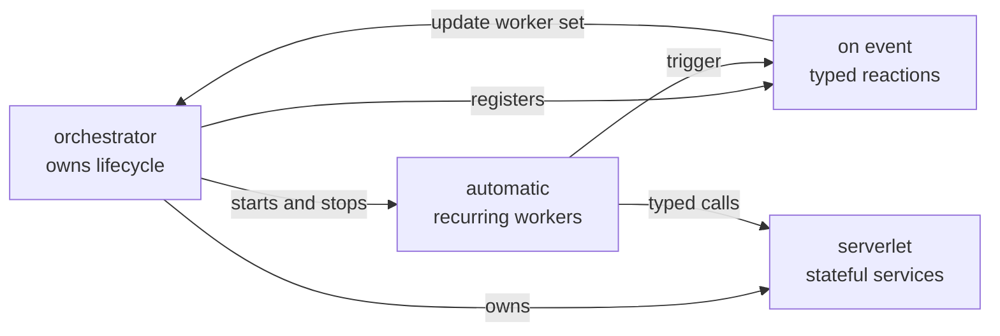

# OrchestrateLang

> A compiled language for coordinating concurrent work, long-lived services, events,
> and code written in other languages.

OrchestrateLang (`.orch`) is for the part of a program that decides **what runs, when it
runs, and how the pieces communicate**. Workers, event handlers, supervised processes,
and stateful services are language constructs rather than patterns assembled from async
libraries.

The compiler turns a program into Rust, wires its concurrency through Tokio, and asks
Cargo to produce a native binary. There is no OrchestrateLang VM or interpreter. The same
source can instead be generated as a Rust library, when an application that already owns
its main loop wants to drive it.

It is young. It is a good place to explore a more structural model of orchestration; read
[current boundaries](#current-boundaries) before using it as production infrastructure.

## Install and run

You need [Rust and Cargo](https://rustup.rs/). Clone the repository and install the
compiler:

```bash
git clone https://github.com/Immanuel-Fowler/OrchestrateLang
cd OrchestrateLang
cargo install --path .
```

Then run the smallest example:

```bash
orchestrate run examples/hello.orch
```

The first run builds a generated Cargo project and may take longer; later runs reuse
`.orch_cache/`.

| Command | What it does |
|---|---|
| `orchestrate run main.orch` | Compile and run a program |
| `orchestrate build main.orch -o app` | Build a release binary |
| `orchestrate check main.orch` | Parse and type-check without building |
| `orchestrate check-foreign main.orch` | Run each foreign language's own checker |
| `orchestrate check-foreign main.orch --deep` | Also run mypy, and check the generated Rust |
| `orchestrate build --lib main.orch -o generated/scripts` | Generate an embeddable Rust crate |
| `orchestrate prom add name ./module` | Register a local module under a short name |

`cargo orch` and `cargo orchestrate` accept the same commands and arguments, so the
compiler is usable from inside a Cargo workflow without leaving it.

Examples live in [examples/](examples/) — `serverlet.orch`, `python_landline.orch`,
`sandboxed_plugin.orch`, `supervised_process.orch`, thirty-one in all. Foreign
examples need their own toolchain: Python 3.10+, TypeScript 7 and Bun, Zig, Swift, or the
.NET SDK.

## OrchestrateLang in 30 seconds

Four ideas decide what this language is. Each has a document of its own, linked from its
heading.

### 1. [Concurrency is the structure](docs/design/concurrency-is-the-structure.md)

Five declarations, five owners: `orchestrator` owns lifecycle, `automatic` owns recurring
work, `on` owns reactions, `serverlet` owns state, and `parallel` is a join point. There
is no `spawn` to call and no channel to build.

```orchestrate
fn read_sensor() -> int {
    95
}

let monitor = automatic(restart: always) {
    let reading = read_sensor()
    if reading > 90 {
        trigger overheated(reading)
    }
    sleep(500)
} on_crash error {
    print("monitor crashed: {error}")
}

let alarm = on overheated(reading: int) {
    print("temperature is {reading}")
}

orchestrator main(workers: process[monitor]) {
}
```

The compiler supplies the Tokio tasks, the channels, the event registry, the reply
channels, the panic handling, and the shutdown plumbing. Who may touch a binding is also
structural: instance state reaches hooks, `shared let` reaches anything for the cost of
one mutex, and a serverlet's state reaches only its own handlers, one call at a time.



### 2. [Asynchronous first, synchronous second](docs/design/asynchronous-first-synchronous-second.md)

Coordination compiles to one async core. `fn` is the callable form that cannot wait, and
says so with its own diagnostic rather than letting rustc complain about generated code.
`task` and `process` may wait.

The other synchronous edge is ownership. `orchestrate build` makes a program that owns
its runtime; `orchestrate build --lib` makes a crate that a Rust application drives,
from the same source:

| The host is | It calls | An empty tick costs |
|---|---|---|
| Async | `ready().await`, `tick(dt).await`, `shutdown().await` | A task hop |
| Synchronous | `ready_blocking`, `tick_blocking`, `shutdown_blocking` | A task hop |
| Synchronous and hot | `tick_sync(&runtime, dt)` | About 6 ns, on the calling thread |

With `StartOptions { deterministic: true }` the clock becomes the sum of the host's `dt`
values, and the same tick and event sequence produces the same host calls byte for byte —
tested over 10,000 ticks, with the exclusions named.

### 3. [Polyglot: coordination and attachment](docs/design/polyglot-coordination-and-attachment.md)

Reaching into other code is two needs, not one:

- **Attach a function.** `load_foreign` links Rust, C, C++, Zig, Swift, C#, or a `.wasm`
  module into this process. A call costs 1–5 ns and a `.orch_ffi` sidecar declares the
  contract. TypeScript attaches through a compiled executable instead.
- **Coordinate with a service.** A `serverlet` owns state and a lifetime. Its body runs
  in this process, in a separate native child, in a Python or TypeScript process, or
  inside a wasmtime sandbox.

A program pays only for the runtimes it names: no sandbox and no `.wasm` module means no
`wasmtime` dependency, and no C source means no `cc` and no `build.rs`.

### 4. [As many choices as possible are made in syntax](docs/design/choices-in-syntax.md)

Transport, isolation, budget, capability, and lifetime are words in the declaration they
apply to — not configuration sitting beside it. Four boundaries, one call site:

```orchestrate
serverlet Plugin { ... }                                        // in-process actor
serverlet Plugin secret { ... }                                 // separate native child
serverlet Plugin via python(source: "plugin.py") { ... }        // a Python process
serverlet Plugin sandbox(memory_limit: "64mb", timeout: "5s")   // a wasmtime guest
```

In all four the caller writes `let plugin = start Plugin()` and `plugin.run("hello")`.
Changing where a module's code runs is one word on one line, and no caller is touched.
What differs is the guarantees, and those are documented per boundary rather than hidden
behind a common denominator.

## Design philosophy

Those four decide what the language is. Eight more decide how it gets built, and they are
the ones a proposal is checked against:

| Principle | In short |
|---|---|
| General-purpose first | An adopter decides what is built next, never how it is designed |
| Compile to Rust; no hidden runtime | No VM, no GC, no executor of our own; a foreign runtime's cost belongs to the boundary that chose it |
| FFI is stateless; serverlets own state | Show that a serverlet plus FFI is not enough before inventing a new kind |
| Wrap, don't build | Tokio, Cargo, `cc-rs`, wasmtime, each language's own toolchain |
| Be honest about guarantees | "Secret" is not encryption; a process is not a sandbox; gaps are written down |
| The host is in charge | In library mode it owns the loop, the runtime, logging, and process lifetime |
| Measure before promising | Numbers come from `benchmarks/`, with the machine and the commit |
| Finish one story at a time | Done means tests, docs, a changelog entry, and every example still running |

The full text is in [docs/design-philosophy.md](docs/design-philosophy.md).

## Features

| Area | What there is | Documented in |
|---|---|---|
| Types and data | `int`, `float`, `string`, `bool`, arrays, structs, enums with payloads, `option<T>`, `result<T, E>`, function types, generics, `handle` | [reference §2](docs/language-reference.md) |
| Control flow | `if`/`while`/`for`, `match` with exhaustiveness checking, `try`/`catch`, `?`, pipelines, closures, string interpolation | [reference §2](docs/language-reference.md) |
| Orchestration | `orchestrator`, `automatic` with restart policies and `on_crash`, `on`/`trigger` events, `process[...]`, `update_orchestrator`, lifecycle hooks | [reference §3–4](docs/language-reference.md) |
| State | Instance `let`, `shared let` behind one mutex, serverlet-owned state | [shared-state.md](docs/features/shared-state.md) |
| Serverlets | In-process, `secret` child processes, Python and TypeScript landlines with budgets and late policies, `sandbox(...)` guests with grants | [features/](docs/features/) |
| Modules | Directory modules with `use module`, `load` for sub-files, PROM for machine-local names, a standard library | [reference §6](docs/language-reference.md) |
| Foreign code | `load_foreign` for Rust, C, C++, Zig, Swift, C#, TypeScript, and WebAssembly, with `.orch_ffi` sidecars | [reference §6.4](docs/language-reference.md) |
| Library mode | `build --lib`, a generated `Host` trait, typed and fixed ticks, host-fired events, deterministic replay, logging, packaging | [library-mode.md](docs/library-mode.md) |
| Tooling | `check`, `check-foreign`, an LSP server, a VS Code extension, Cargo subcommands, `ORCH_SHOW_GENERATED` | [reference §5](docs/language-reference.md) |

`orchestrate check` rejects 76 of the 84 deliberately invalid programs in the diagnostics
corpus without generating any code. What it does and does not guarantee is stated
precisely in the [language reference](docs/language-reference.md).

## Benchmarks

Performance claims come from scripts in [benchmarks/](benchmarks/), not from memory. One
command regenerates every table:

```bash
python3 benchmarks/run_all.py
```

It writes CSV, JSON, and Markdown under `benchmarks/results/`, each with an environment
header naming the CPU, OS, toolchain versions, sample counts, and commit. A run on an
Apple M2:

| Measurement | Result |
|---|---|
| Serverlet round trip, p50 | 7–14 µs in-process, 7–13 µs sandboxed, 17–25 µs secret child, 24 µs Python, 45 µs TypeScript |
| The same, paced at 100 Hz | 33 µs in-process, 34 µs sandboxed, 60 µs secret, 85 µs Python, 108 µs TypeScript |
| The same, 8 concurrent callers | 6 µs in-process, 7 µs sandboxed, 87 µs secret, 129 µs Python, 249 µs TypeScript |
| `shared let` | About 9 ns per statement |
| Empty `tick_sync` in library mode | About 6 ns; a host call adds about 1.4 ns |
| Foreign function call | 1–2 ns for C, Zig, and Swift; about 5 ns for C# |

The tail matters more than the median for per-tick work, which is why every table carries
p90, p99, and max, and why landlines can declare a `budget`. The caveats — what the
numbers do not say — are in [benchmarks/README.md](benchmarks/README.md).

## Current boundaries

The most important limitations are behavioral, not cosmetic:

- A sandboxed serverlet contains its guest's compute, memory, and reach, as well as
  wasmtime does. It carries what the C ABI carries; an array of strings or structs, or a
  struct holding one, does not cross it, though the other three boundaries carry them.
  Its `grant call` lines are the only way it reaches the host, and only in a library
  build.
- A separate process provides lifecycle and crash separation, not a security boundary.
- Python and TypeScript are the supported landline runtimes today.
- Cross-process serverlet and TypeScript values use an explicit protocol and therefore
  cost more than direct in-process calls.
- Deterministic library mode covers lifecycle and event hooks, not spawned workers or
  serverlets.
- Outside library mode, `on_stop` runs on Ctrl+C; `stop_orch()` exits immediately.
- Cross-compilation of foreign code depends on each foreign toolchain and is limited.
- Some diagnostics can still surface from generated Rust. Set `ORCH_SHOW_GENERATED=1`
  to print the generated source and full Cargo output.

Every gap found and not yet closed is collected in
[LIMITATIONS-notes.md](LIMITATIONS-notes.md); release-specific notes are in the
[changelog](CHANGELOG.md).

## Documentation map

- [Language reference](docs/language-reference.md) — syntax, types, compiler behavior,
  and generated-code details
- [Design philosophy](docs/design-philosophy.md) — the principles used to evaluate new
  features, indexing the four foundations in [docs/design/](docs/design/)
- [Feature designs](docs/features/) — one document per feature: the problem, the design,
  what was hard, and what shipped
- [Library mode](docs/library-mode.md) — host lifecycle, ticks, events, callbacks,
  deterministic execution, and packaging
- [Benchmarks](benchmarks/README.md) — the boundary ladder, tick cost, and diagnostics
  coverage, and how to regenerate them
- [Python SDK](sdk/python/README.md) — Python landline implementation and setup
- [TypeScript SDK](sdk/typescript/README.md) — TypeScript FFI and landlines
- [Roadmap](docs/roadmap.md) — proposed work, clearly separated from shipped behavior
- [Changelog](CHANGELOG.md) — release history and known limitations
- [Contributing](CONTRIBUTING.md) — development and release conventions

## License

OrchestrateLang is available under the [MIT License](LICENSE).
