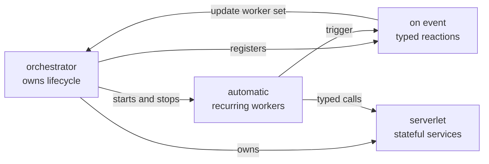
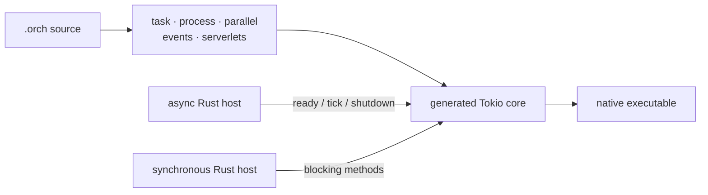
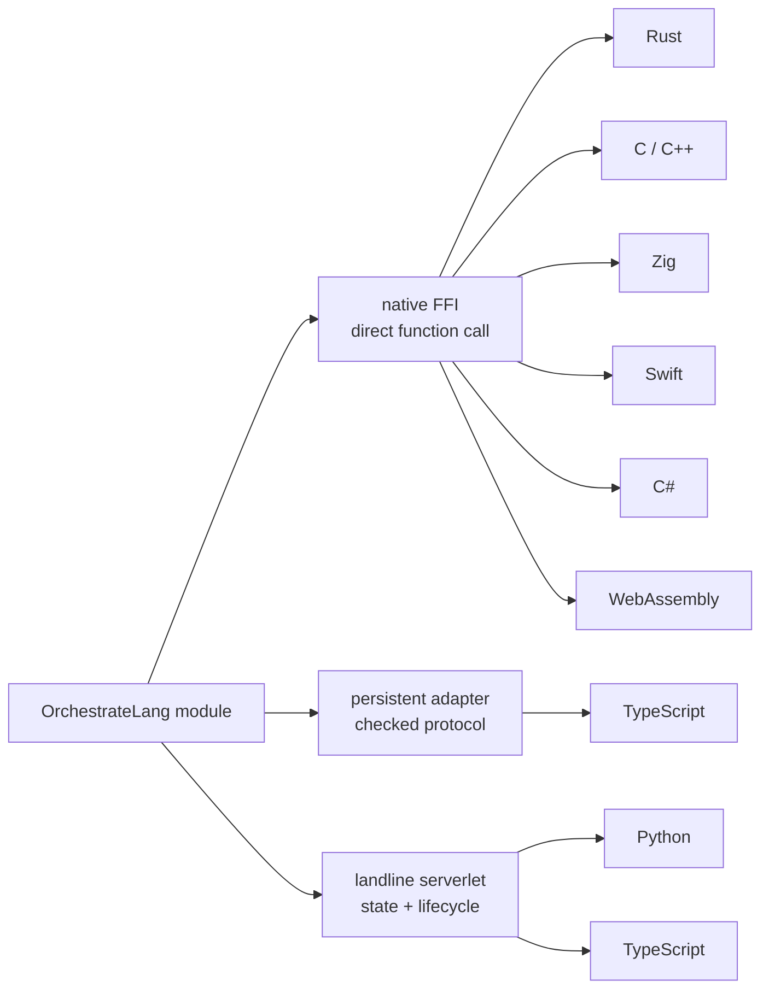
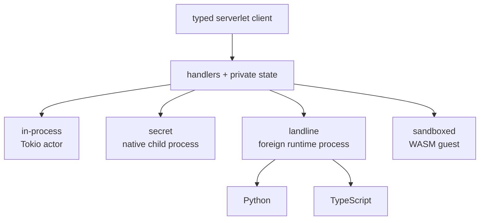

# OrchestrateLang

> A compiled language for coordinating concurrent work, long-lived services, events,
> and code written in other languages.

OrchestrateLang (`.orch`) is for the part of a program that decides **what runs, when it
runs, and how the pieces communicate**. Workers, event handlers, supervised processes,
and stateful services are language constructs rather than patterns assembled from async
libraries.

The compiler turns an OrchestrateLang program into Rust, wires its concurrency through
Tokio, and asks Cargo to produce a native binary. There is no OrchestrateLang VM or
interpreter. A program can also be generated as a Rust library when an existing
application needs to own the main loop.

## OrchestrateLang in 30 seconds

### 1. Orchestration is the program structure

The lifecycle, recurring work, reactions, and stateful services are visible in the
language instead of being hidden behind task and channel setup.



| Construct | What it makes explicit |
|---|---|
| `orchestrator` | Startup, shutdown, and the active process set |
| `automatic` | Recurring work, restart policy, and crash handling |
| `on` / `trigger` | Typed event producers and consumers |
| `serverlet` | Long-lived state with serialized message handling |

### 2. Asynchronous first, synchronous second

OrchestrateLang models coordination as asynchronous work. When a synchronous application
embeds it, blocking adapters drive the same generated async core—the sync API is a host
boundary, not a second runtime model.



| Execution path | Interface | Status |
|---|---|---|
| Standalone orchestration | Async tasks, processes, events, and services | Shipped |
| Async Rust host | `ready().await`, `tick().await`, `shutdown().await` | Shipped |
| Synchronous Rust host | `ready_blocking`, `tick_blocking`, `shutdown_blocking`; `tick_sync` runs a tick on the calling thread | Shipped |
| Deterministic host time | Host-driven ticks and ordered event handling | Shipped, with documented limits |

### 3. Polyglot by choosing the right boundary

Direct native functions stay cheap. Stateful or runtime-owned code becomes a service.
The boundary is selected per module rather than forcing the entire application into one
language or one transport.



| Language | Direct functions | Stateful service | Status |
|---|---|---|---|
| OrchestrateLang | Native module call | In-process or secret serverlet | Shipped |
| Rust | In-module integration | Wrap with an OrchestrateLang serverlet | Shipped |
| C / C++ | Native C ABI | A `handle` to a native object, or a serverlet | Shipped |
| Zig | Native C ABI | A `handle` to a native object, or a serverlet | Shipped |
| Swift | Native C ABI | A `handle` to a native object, or a serverlet | Shipped |
| TypeScript | Persistent compiled adapter | Landline serverlet | Shipped |
| WebAssembly | Any `.wasm` module, checked against its exports | Sandboxed serverlet | Shipped |
| Python | — | Landline serverlet | Shipped |
| C# | Native AOT shared library, about 5 ns a call | Wrap with a serverlet | Shipped |
| Go | C archive is possible, with runtime constraints | — | Exploring |
| Additional embedded runtimes | Depends on a safe native boundary | Landline-style adapter | Exploring |

“Planned” and “exploring” rows describe direction, not current compiler support. See the
[roadmap](docs/roadmap.md) for the tradeoffs behind them.

### 4. Serverlets are one service model with several boundaries

Every serverlet presents the same idea to its caller: start a typed service, keep its
state alive, and send it serialized calls. The variant decides where the implementation
runs and what guarantee that boundary provides.



| Serverlet kind | Boundary | Best fit | Status |
|---|---|---|---|
| In-process | Tokio task and channel | Trusted state with the lowest overhead | Shipped |
| Secret | Separate native executable | Process lifecycle, crash separation, hidden implementation | Shipped |
| Python landline | Persistent Python process | Existing Python libraries and state | Shipped |
| TypeScript landline | Compiled TypeScript process | Existing TypeScript code and state | Shipped |
| Sandboxed | WASM guest under wasmtime, with a memory cap and a timeout | Untrusted or downloaded code | Shipped |
| Secret + sandboxed | Process plus WASM containment | Defense in depth | Planned |
| Serverlet files | Independently packaged/live-editable services | Modding and hot-reload workflows | Exploring |
| More landlines | C#, C++, and embedded runtimes | Reuse another runtime behind the same client | Planned / exploring |

The next major serverlet work is real containment and broader runtime support. A child
process alone is not called a sandbox, and roadmap entries are not presented as finished
features.

OrchestrateLang is currently young and evolving. It is a good place to explore a more
structural model of orchestration; read the [known limitations](#current-boundaries) before
using it as production infrastructure.

## The idea in one program

```orchestrate
fn read_sensor() -> int {
    95
}

let monitor = automatic(restart: always) {
    let reading = read_sensor()
    if reading > 90 {
        trigger overheated(reading)
    }
    sleep(500)
} on_crash error {
    print("monitor crashed: {error}")
}

let alarm = on overheated(reading: int) {
    print("temperature is {reading}")
}

orchestrator main(workers: process[monitor]) {
}
```

This describes three different responsibilities:

- `automatic` owns recurring background work and its restart policy.
- `on` owns a reaction to an event.
- `orchestrator main` owns the application lifecycle and chooses which workers run.

The compiler supplies the Tokio tasks, channels, event registries, process handles, and
shutdown plumbing. The source stays focused on the topology of the system.

## Why a language?

Coordination code tends to hide its architecture inside library calls: spawn a task here,
clone a sender there, wrap state in a lock, and remember which component is responsible
for shutting everything down. It works, but the important shape of the program is only
visible after reading its implementation.

OrchestrateLang makes that shape syntax. A reader can identify workers, reactions,
services, process boundaries, foreign code, and the lifecycle owner directly from the
source. Rust remains underneath for native compilation and interoperability, but the
orchestration model is expressed at a higher level.

This is not intended to replace Rust, Python, TypeScript, C++, or another implementation
language. It is meant to coordinate them.

## Install and run

You need [Rust and Cargo](https://rustup.rs/). Clone the repository and install the
compiler:

```bash
git clone https://github.com/Immanuel-Fowler/OrchestrateLang
cd OrchestrateLang
cargo install --path .
```

Then run the smallest example:

```bash
orchestrate run examples/hello.orch
```

The same CLI is available as a Cargo subcommand:

```bash
cargo orch run examples/hello.orch
cargo orchestrate check examples/hello.orch
```

The first run builds a generated Cargo project and may take longer. Later runs reuse
`.orch_cache/`.

Useful commands:

| Command | What it does |
|---|---|
| `orchestrate run main.orch` | Compile and run a program |
| `orchestrate build main.orch -o app` | Build a release binary |
| `orchestrate check main.orch` | Parse and type-check without building |
| `orchestrate check-foreign main.orch` | Run each foreign language's own checker |
| `orchestrate check-foreign main.orch --deep` | Also run mypy and check generated Rust |
| `orchestrate build --lib main.orch -o generated/scripts` | Generate an embeddable Rust crate |
| `orchestrate prom add name ./module` | Register a local module under a short name |

`cargo orch` and `cargo orchestrate` accept the same commands and arguments.

## How a program runs

When you run `orchestrate run main.orch`, the compiler:

1. lexes and parses the `.orch` source;
2. resolves directory modules and merges files named by `load`;
3. registers types and checks the program;
4. generates Rust for the program, modules, events, and service clients;
5. prepares any foreign-language adapters or child processes;
6. writes a Cargo project under `.orch_cache/`; and
7. invokes Cargo to build and run a native executable.

```text
main.orch + module directories + foreign sources
                       │
              Orchestrate compiler
                       │
             generated Rust project
                       │
                 Cargo + rustc
                       │
                 native program
```

Most OrchestrateLang concurrency becomes Tokio tasks and channels. Native foreign
functions are linked into the executable. Secret and landline serverlets communicate
with child processes using a checked wire protocol.

## Design principles

### Concurrency should be structural

Workers, handlers, and services are declarations with different lifetimes—not anonymous
tasks that happen to follow a convention. `automatic`, `on`, `serverlet`, and
`orchestrator` each say who owns looping, reactions, state, and lifecycle.

### Compile to Rust; do not hide a runtime

OrchestrateLang uses the Rust ecosystem instead of building a VM, garbage collector, or
async executor. The generated program is ordinary compiled Rust. A foreign boundary may
bring its own runtime—Python and TypeScript do—and the documentation treats that cost as
part of the chosen boundary.

### Use the cheapest boundary that works

Not every dependency needs an actor or a child process:

| Need | Mechanism |
|---|---|
| A direct, stateless function | Module function or `load_foreign` |
| Persistent state with serialized access | In-process serverlet |
| A separate runtime or process-level crash isolation | Landline or secret serverlet |
| Untrusted code | A real sandbox—not merely a process |

This ladder keeps simple calls simple while leaving explicit tools for isolation and
lifecycle.

### State belongs to services

Foreign function calls stay function calls. Persistent mutable state belongs to a
serverlet, where ownership and call ordering are clear. A serverlet can still call direct
foreign functions internally.

### Boundaries should be visible

A module directory has a `module.orch` boundary. Foreign functions have an
`.orch_ffi` contract. Landlines declare the host functions they may call. These markers
are intentionally explicit and easy to inspect.

### The host stays in charge

In library mode, the Rust host owns its runtime, loop, logging, and process lifetime.
OrchestrateLang exposes lifecycle and tick methods; it does not quietly take over the
application.

### Be honest about guarantees

A separate process is not a security sandbox. “Secret” means the implementation is built
outside the orchestrator binary, not encrypted. A sandboxed serverlet does contain its
guest, but only as well as wasmtime does, and only the guest's compute, memory, and reach
— not the answers it returns. The project names these boundaries precisely rather than
letting a word imply the stronger guarantee.

The full rationale is in [Design Philosophy](docs/design-philosophy.md).

## Language features

The sections below explain what each feature is for. They are a tour, not a grammar or
complete API reference; exact syntax and edge cases belong in the
[language reference](docs/language-reference.md).

| Feature | The problem it owns |
|---|---|
| Static types, structs, enums, and generics | Describe data and check boundaries before execution |
| Functions, tasks, processes, and `parallel` | Separate synchronous work, awaited work, and concurrent work |
| Expressions, pipelines, pattern matching, and closures | Transform and route values clearly |
| `option`, `result`, `?`, and `try` / `catch` | Make absence and failure explicit |
| Orchestrators and lifecycle hooks | Define who owns startup, ticks, and shutdown |
| Automatic workers and supervision | Run recurring work and recover from crashes |
| Events and triggered handlers | Decouple typed producers from any number of consumers |
| Serverlets | Give long-lived state one serialized owner |
| Secret and landline serverlets | Move a service across a process or language boundary |
| Directory modules, PROM, and the standard library | Organize and reuse capabilities behind visible boundaries |
| Foreign functions and foreign checking | Reuse existing code without hiding its native toolchain |
| Library and deterministic modes | Embed orchestration under a Rust host's lifecycle |
| Host grants | Make callbacks from foreign services explicit |
| LSP and VS Code support | Bring language information into an editor |

### Static types and data

OrchestrateLang is statically typed. Local types are often inferred, while function and
service boundaries are explicit.

```orchestrate
let attempts = 3
let label: string = "worker"

struct Reading {
    value: float,
    source: string,
}

enum Status {
    Idle,
    Running(int),
    Failed(string),
}
```

The built-in types include integers, floats, booleans, strings, arrays, `option<T>`,
`result<T>`, and process handles.

### Structs, enums, and pattern matching

Structs group named fields. Enums describe a closed set of alternatives, optionally with
payloads. `match` then makes the cases visible at the point where behavior diverges.

```orchestrate
let description = match status {
    Status::Idle => "waiting"
    Status::Running(count) => "handled {count}"
    Status::Failed(message) => "failed: {message}"
}
```

### Generics

Generic functions preserve types while expressing reusable behavior:

```orchestrate
fn identity<T>(value: T) -> T {
    value
}
```

### Functions, tasks, and processes

The callable forms communicate intent:

- `fn` is synchronous computation.
- `task` is asynchronous computation.
- `process` is an async callable intended for orchestration work.
- `parallel` waits for several operations together instead of running them in sequence.

```orchestrate
fn normalize(value: int) -> int {
    value * 10
}

task fetch(id: int) -> string {
    sleep(100)
    "item {id}"
}

parallel {
    let first = fetch(1)
    let second = fetch(2)
}
```

The compiler inserts the async plumbing where these forms are used from orchestration
code.

### Parallel execution

`parallel` gives a group of independent operations one join point. Each binding becomes
available after the whole group completes, while the operations themselves run
concurrently. It is useful when the work is independent but the next step needs all of
its results.

### Expression-oriented control flow

Blocks, conditionals, `match`, and `try` can produce values. The language also supports
`while`, `for`, ranges, closures, and higher-order array operations.

### Pipelines

The pipeline operator, `|>`, passes a value through a readable left-to-right sequence:

```orchestrate
let result = input |> normalize() |> validate()
```

### Errors and optional values

`result<T>` represents success or an error string; `option<T>` represents a value that
may be absent. `?` propagates errors, and `try` / `catch` handles them at a chosen
boundary.

```orchestrate
fn load_count(text: string) -> result<int> {
    let count = parse_int(text)?
    ok(count)
}

let count = try {
    load_count(raw)?
} catch error {
    print("using zero: {error}")
    0
}
```

### String interpolation

Values can be embedded directly in strings with `{name}`. Interpolation keeps logging and
diagnostic messages readable without repeated `to_string` calls and concatenation.

### Arrays and closures

Arrays support indexing and mutation. Closures make collection transformations local to
the operation that uses them, and built-ins cover `length`, `append`, `remove`, `map`,
`filter`, `reduce`, `find`, `any`, and `all`.

### The orchestrator

`orchestrator main` is the standalone program entry point. It initializes event
listeners, starts the selected workers, runs lifecycle hooks, and keeps the program alive.

```orchestrate
orchestrator main(workers: process[poller, reporter]) {
    on_start {
        print("ready")
    }

    on_stop {
        print("shutting down")
    }
}
```

Named orchestrators can also be called as async coordinators. In a standalone program,
`stop_orch()` requests termination; in library mode it asks the host to stop without
exiting the host process.

### Lifecycle hooks

`on_start` performs setup after the runtime is ready. `on_stop` performs coordinated
cleanup when that lifecycle path is available. In library mode the host explicitly
awaits both ends of the lifecycle; in a standalone binary, Ctrl+C runs `on_stop`, while
`stop_orch()` exits immediately.

### Automatic workers and supervision

An `automatic` block is recurring background work. It owns its loop and runs as a Tokio
task when included in the orchestrator's process set.

```orchestrate
let poller = automatic(restart: 3) {
    poll_once()
    sleep(1000)
} on_crash error {
    print("poller crashed: {error}")
}
```

Restart policies are `never`, a retry count, or `always` with backoff. The built-in
`update_orchestrator` event replaces the active worker set at runtime: removed workers
are stopped, new workers start, and unchanged workers continue.

### Dynamic worker sets

The `process[...]` annotation seeds the workers an orchestrator owns. Triggering
`update_orchestrator([...])` replaces that set while the program is running, which makes
the desired topology explicit instead of spreading spawn and abort handles throughout
application code.

### Events and triggered handlers

An `on` block subscribes to an event. `trigger` broadcasts a typed payload to every
listener for that event.

```orchestrate
let audit = on user_created(id: int, name: string) {
    print("created {id}: {name}")
}

trigger user_created(42, "Mina")
```

Handlers register automatically. Event registries are local to one compiled process;
events do not silently cross into another executable.

### Serverlets: stateful actors

A serverlet is a long-lived service with private state. Starting one returns a typed
client. Calls are handled one at a time, so the service owns its mutable state without
making callers manage locks.

```orchestrate
serverlet Counter {
    let value = 0

    on add(amount: int) -> int {
        value = value + amount
        value
    }
}

orchestrator main() {
    let counter = start Counter()
    print(to_string(counter.add(5)))
    stop_orch()
}
```

There are several serverlet boundaries:

| Kind | Where it runs | Why to choose it |
|---|---|---|
| `serverlet X { ... }` | In-process Tokio task | Trusted stateful service with the lowest overhead |
| `serverlet X secret { ... }` | Separate native child process | Keep implementation out of the main binary and isolate crashes |
| `serverlet X via python(...)` | Persistent Python process | Stateful Python service and host callbacks |
| `serverlet X via typescript(...)` | Persistent compiled TypeScript process | Stateful TypeScript service and host callbacks |
| `serverlet X sandbox(...)` | WASM guest under wasmtime | Untrusted code, with a memory cap and a per-call timeout |

Secret and landline serverlets perform a startup handshake that checks protocol and
handler signatures. Landlines also support call budgets and policies for late replies.
See the [Python SDK](sdk/python/README.md), [TypeScript SDK](sdk/typescript/README.md), and
[landline design](docs/design/landline-serverlets.md).

### Secret serverlets

A secret serverlet is compiled as a separate native executable. Its state and handler
implementation live in that child, while the orchestrator holds a typed client mirror.
This provides process lifecycle and crash separation and keeps the implementation out of
the main executable. It does not encrypt the child or turn it into a security boundary.

### Python and TypeScript landlines

A landline keeps foreign code alive behind the same typed serverlet interface. Python
runs through its interpreter; TypeScript is compiled to an executable. Calls travel over
framed stdin/stdout messages, state persists between calls, and startup validates the
declared interface. Budgets bound how long a caller waits, while `late: "drop"` and
`late: "latest"` choose what happens to a delayed result.

### Directory-based modules

A module is a directory whose public boundary is `module.orch`. This is more than a file
naming convention: the directory is the unit a program consents to load, and paths inside
the module resolve from that boundary.

```text
my_app/
├── main.orch
└── inventory/
    ├── module.orch
    ├── models.orch
    └── scoring.rs
```

```orchestrate
// main.orch
use module inventory: "./inventory"
let score = inventory.score(42)

// inventory/module.orch
load "models.orch"
load_foreign "rust" "scoring.rs"
```

`load` merges another OrchestrateLang file into the module. Plain module functions are
compiled alongside the caller and called directly. A module can also contain serverlets
and foreign implementations.

Modules may be addressed by relative directory path or through PROM, the Personal
Registry for Orchestrator Modules:

```bash
orchestrate prom add inventory ../shared/inventory
orchestrate prom list
```

```orchestrate
use module inventory: "inventory"
```

PROM entries are local to the machine. The bundled `lists` and `strings` modules use the
same module mechanism.

### Standard library modules

The standard library intentionally uses the ordinary module system rather than a hidden
privileged path. The compiler embeds the current `lists` and `strings` modules so they
remain available after installation, and programs import them with `use module` like any
other registered capability.

### Polyglot functions and FFI

Inside a module, `load_foreign` makes functions written in Rust, C, C++, Zig, Swift, or
TypeScript available under the module namespace. An adjacent `.orch_ffi` file declares
the contract that OrchestrateLang type-checks.

```orchestrate
// math/module.orch
load_foreign "zig" "vectors.zig"

// math/vectors.orch_ffi
dot(x: int, y: int) -> int
```

Rust source is incorporated into generated module code. C, C++, Zig, and Swift use native
C-ABI linking. TypeScript 7 checks a generated protocol adapter, then scriptc is attempted
and Bun is used when required; one process is reused per imported TypeScript module.

FFI is the direct-call boundary. Use it for functions, not for modeling a service. When
state, independent lifetime, host callbacks, budgets, or serialized message handling
matter, put that behavior behind a serverlet.

### Foreign-language checking

`check-foreign` lets the language that owns a source file diagnose it:

```bash
orchestrate check-foreign main.orch
orchestrate check-foreign main.orch --deep
```

C and C++ use the platform compiler, Zig uses `zig`, Swift uses `swiftc`, TypeScript uses
TypeScript 7, and Python landlines use `py_compile`. The deep pass adds mypy for Python
and checks generated Rust in its complete Cargo context. TypeScript is checked against
the declared OrchestrateLang interface, not only as an isolated `.ts` file.

### Library mode: embedding in a Rust host

Standalone mode lets the orchestrator own the process. Library mode reverses that
relationship: an existing Rust application owns the main loop and embeds generated
OrchestrateLang code.

```bash
orchestrate build --lib scripts/main.orch -o generated/scripts
```

The output is a Rust crate that the host can use as a path dependency. It exposes a
`Scripts` instance with lifecycle methods such as `ready`, `tick`, `fixed_tick`, and
`shutdown`, plus typed methods for events declared in the script.

OrchestrateLang code can declare functions that the host must implement:

```orchestrate
host engine {
    fn entity_count() -> int
    fn set_paused(paused: bool)
}

on_tick(dt: float) {
    print("tick {dt}")
}
```

The generated Rust API includes the corresponding `Host` trait. Logging is routed to the
host, and `stop_orch()` sets a stop request instead of terminating the application.
Synchronous wrappers are available for hosts that already own a Tokio runtime.

Library mode also supports:

- typed tick input and output;
- fixed-step ticks;
- host-triggered OrchestrateLang events;
- per-instance state;
- configurable shutdown grace periods and Python executables;
- packaging landline and secret-serverlet assets with the generated crate; and
- deterministic, host-driven execution for lifecycle and event hooks.

Deterministic mode deliberately excludes spawned workers, serverlets, landlines, and
uncontrolled sleeps. It makes the supported host-driven portion reproducible rather than
claiming determinism for work the host cannot schedule.

See [Library mode and host integration](docs/library-mode.md) for the generated API,
lifecycle order, grants, packaging, and examples.

### Deterministic mode

With deterministic start options, tick values supplied by the host become the source of
time for lifecycle and event work. Events are drained in a defined order and sleeping
handlers resume only after enough host-driven time has passed. The same tick and event
sequence can therefore produce the same host calls, provided the host functions are also
deterministic.

### Host grants for landlines

In library mode, Python and TypeScript landlines can call functions implemented by the
Rust host. Each landline explicitly lists the calls it is granted. Grants constrain the
generated host-call interface; they do **not** restrict the foreign process's filesystem,
network, or operating-system permissions.

### Editor support

The repository includes a VS Code language definition with highlighting and snippets.
The `orchestrate-lsp` binary provides hover type information. Editor support is useful but
still much smaller than the compiler itself; it should not be read as a complete IDE
experience yet.

## Choosing a boundary

If several features seem capable of the same job, start here:

- Keep pure OrchestrateLang helpers in a directory module.
- Use native FFI for a stateless function already written in another compiled language.
- Use an in-process serverlet for owned state or serialized access.
- Use a landline when a Python or TypeScript runtime should stay alive as a service.
- Use a secret serverlet when the implementation should be a separate native executable.
- Use `sandbox(...)` for untrusted code: it runs in a WASM guest that reaches nothing,
  under a memory cap and a per-call timeout.
- Use library mode when a Rust application, rather than the script, must own time and
  lifecycle.

## A typical project

```text
my_project/
├── main.orch                 # standalone entry point
├── analytics/
│   ├── module.orch           # module boundary
│   └── helpers.orch          # merged with load
├── database/
│   └── module.orch           # may declare serverlets
├── scripts/
│   └── worker.py             # landline implementation
└── .orch_cache/              # generated; do not edit
```

For an embedded project, `main.orch` may instead be the input to `build --lib`, and the
generated crate lives wherever the host project expects path dependencies.

## Current boundaries

The most important limitations are behavioral, not cosmetic:

- A sandboxed serverlet contains its guest's compute, memory, and reach, as well as
  wasmtime does. `grant` and `on_crash` are not supported on one yet, and arrays and
  structs do not cross the boundary.
- A separate process provides lifecycle and crash separation, not a security boundary.
- Python and TypeScript are the supported landline runtimes today.
- Cross-process serverlet and TypeScript values use an explicit protocol and therefore
  cost more than direct in-process calls.
- Deterministic library mode covers lifecycle and event hooks, not spawned workers or
  serverlets.
- Outside library mode, `on_stop` runs on Ctrl+C; `stop_orch()` exits immediately.
- Cross-compilation of foreign code depends on each foreign toolchain and is limited.
- Some diagnostics can still surface from generated Rust. Set `ORCH_SHOW_GENERATED=1`
  to print the generated source and full Cargo output.

Release-specific limitations and compatibility notes are maintained in the
[changelog](CHANGELOG.md).

## Explore the examples

```bash
orchestrate run examples/async_parallel.orch
orchestrate run examples/task_demo.orch
orchestrate run examples/serverlet.orch
orchestrate run examples/secret_serverlet.orch
orchestrate run examples/python_landline.orch
orchestrate run examples/typescript_landline.orch
orchestrate run examples/error_handling.orch
orchestrate run examples/enums.orch
orchestrate run examples/generics.orch
orchestrate run examples/supervised_process.orch
```

Foreign-language examples may require their language toolchain. Python landlines require
Python 3.10 or newer. TypeScript FFI and landlines require TypeScript 7 and Bun; Zig and
Swift examples require their respective compilers.

## Documentation map

- [Language reference](docs/language-reference.md) — syntax, types, compiler behavior,
  and generated-code details
- [Design philosophy](docs/design-philosophy.md) — the principles used to evaluate new
  features
- [Library mode](docs/library-mode.md) — host lifecycle, ticks, events, callbacks,
  deterministic execution, and packaging
- [Python SDK](sdk/python/README.md) — Python landline implementation and setup
- [TypeScript SDK](sdk/typescript/README.md) — TypeScript FFI and landlines
- [Benchmarks](benchmarks/README.md) — measuring serverlet latency
- [Roadmap](docs/roadmap.md) — proposed work, clearly separated from shipped behavior
- [Changelog](CHANGELOG.md) — release history and known limitations
- [Contributing](CONTRIBUTING.md) — development and release conventions

## License

OrchestrateLang is available under the [MIT License](LICENSE).
