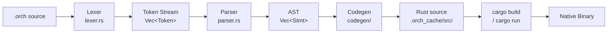

# OrchestrateLang Documentation

OrchestrateLang (`.orch`) is a compiled, asynchronous-first language for writing concurrent system coordinators. It compiles directly to native Rust and runs on the Tokio runtime — giving you native machine speed with zero interpreter overhead.

This file contains two independent guides. Jump to whichever fits your needs:

- **[Part I — User Manual](#part-i--user-manual)** · For developers who want to write `.orch` scripts and connect services together.
- **[Part II — Internals Manual](#part-ii--internals-manual)** · For contributors who want to understand how the compiler and runtime work under the hood.

---
---

# Part I — User Manual

> *For developers scripting infrastructure, connecting services, and coordinating background workers.*

---

## Chapter 1 · Why OrchestrateLang?

Modern distributed systems require gluing together background workers, event listeners, service clients, and real-time data pipelines. In conventional languages this coordination logic becomes deeply nested async code full of channels, mutexes, and spawned tasks with no clear ownership.

OrchestrateLang treats **concurrency as a first-class language concept**. Workers, event listeners, and service actors are declared at the language level — not assembled from library primitives.

### A Motivating Example

The following program polls a sensor every 500ms, broadcasts an alert when temperature is critical, and shuts down cleanly on the alert:

```orchestrate
let monitor = automatic {
    let temp = sensor.read_temperature()
    if temp > 90 {
        trigger overheat_alert(temp)
    }
    sleep(500)
}

let responder = on overheat_alert(temp: int) {
    print("CRITICAL — temperature at " + to_string(temp) + "°C")
    trigger update_orchestrator([])
}

orchestrator main(procs: process[]) { }
```

**What this gives you for free:**
- `monitor` runs forever on its own Tokio task, automatically looping
- `responder` is registered as an event listener on boot — no setup code needed
- `trigger update_orchestrator([])` cleanly aborts all running workers
- The whole program compiles to a native binary — no VM, no runtime overhead

---

## Chapter 2 · Language Syntax Reference

### 2.1 Variables

Variables are declared with `let`. Type annotations are optional — the compiler infers types from the assigned value:

```orchestrate
let name   = "Orchestrate"   // string
let count  = 0               // int
let ratio  = 3.14            // float
let active = true            // bool

// Explicit annotation
let threshold: int = 100
```

Variables are mutable by default. Reassign with `=`:

```orchestrate
count = count + 1
```

#### `shared let`

A top-level `let` belongs to the instance, and only hooks — `on_tick`, `on_start`,
`on_stop`, and event handlers — can reach it. That is deliberate: a spawned worker can run
while a tick holds that state, so letting both touch it would be a data race. A `fn`,
`task`, or `process` that names one is a compile error.

When several concurrent things genuinely need the same value, mark it `shared`:

```orchestrate
let counter = 0          // instance-owned, hooks only, free
shared let hits = 0      // any task, any fn, synchronised
```

Every `shared` binding lives behind one mutex, taken once per statement, so:

> **A statement that touches shared state is atomic with respect to all shared state.**

That makes `hits = hits + 1` correct without thinking about it, and there is no lock order
to get wrong. A read produces a copy. Because taking the lock does not wait, **a plain `fn`
may touch shared state** even though it may not call a serverlet.

One rule follows from the lock: **a statement may wait, or touch shared state, not both.**
Holding the lock across a wait would block every other reader, so
`total = total + fetch()`, where `fetch` is a task, is refused and asks you to split it.

`int`, `float`, `bool`, `string`, arrays, options and structs can be shared. A serverlet
client, a process, or a closure cannot — the first two are already safe to use
concurrently, and the third is not data. A program that never writes `shared` gains no
mutex and no cost.

### 2.2 Types

| Type | Description | Example |
| :--- | :--- | :--- |
| `int` | 64-bit signed integer | `let x = 42` |
| `float` | 64-bit floating point | `let pi = 3.14` |
| `string` | UTF-8 text | `let s = "hello"` |
| `bool` | True or false | `let ok = true` |
| `void` | No return value | (used in function signatures) |
| `process` | A handle to a process block | `let p: process = automatic { ... }` |
| `process[]` | Array of process handles | `orchestrator main(procs: process[])` |
| `T[]` | Array of `T` | `let xs: int[] = [1, 2, 3]` |
| `option<T>` | A value or `none` | `some(3)`, `none` |
| `result<T>` | A value or a string error | `ok(3)`, `err("bad input")` |
| `fn(A) -> B` | A function value | `let f: fn(int) -> int = fn(x: int) -> int { x }` |
| `handle` | An opaque native object from a C-ABI foreign module | `let c = native.make_counter(0)` |

#### User-Defined Structs

Declare a struct to group related values, then construct it with a struct literal
and read fields with `.`:

```orchestrate
struct Point {
    x: int,
    y: int,
}

orchestrator main() {
    let p = Point { x: 3, y: 4 }
    print(to_string(p.x))   // 3
}
```

Struct fields may be any type (`int`, `float`, `string`, `bool`, or another
struct). Structs compile to a Rust `struct` deriving `Clone` and `Debug`.

### 2.3 Operators

#### Arithmetic
```orchestrate
let sum  = a + b
let diff = a - b
let prod = a * b
let quot = a / b
```

#### String Concatenation
The `+` operator is overloaded for strings. You can concatenate strings with other strings or with `to_string()` output:
```orchestrate
let msg = "Count is: " + to_string(count)
let banner = "Hello, " + name + "!"
```

#### Comparison
```orchestrate
a == b    // equal
a != b    // not equal
a < b     // less than
a > b     // greater than
a <= b    // less than or equal
a >= b    // greater than or equal
```

#### Logical
```orchestrate
a && b    // and
a || b    // or
```

#### Assignment
```orchestrate
count = count + 1
```

### 2.4 Control Flow

#### If / Else
`if` is an expression — it returns the value of whichever branch runs:

```orchestrate
if score >= 60 {
    print("Pass")
} else {
    print("Fail")
}

// Used as a value
let label = if priority >= 3 { "HIGH" } else { "LOW" }
```

#### While
```orchestrate
let i = 0
while i < 10 {
    print(to_string(i))
    i = i + 1
}
```

### 2.5 Functions

Plain synchronous functions are declared with `fn`:

```orchestrate
fn add(a: int, b: int) -> int {
    return a + b
}

fn greet(name: string) {
    print("Hello, " + name + "!")
}
```

For **async** operations (anything that involves I/O or waiting), use `task`. Calls to tasks inside process blocks are automatically awaited:

```orchestrate
task fetch(url: string) -> string {
    sleep(200)
    return "data from " + url
}

let worker = automatic {
    let result = fetch("https://api.example.com")  // awaited automatically
    print(result)
}
```

You can also use the `process` keyword to declare a named async function. This is functionally equivalent to `task` — both compile to `async fn` — but `process` signals intent that the function is meant to be used as a concurrency unit (e.g. started manually via `start` in an orchestrator):

```orchestrate
process fetch_user(id: int) -> string {
    sleep(1000)
    return "User_" + to_string(id)
}

process fetch_posts(id: int) -> string {
    sleep(1500)
    return "Posts_for_" + to_string(id)
}

let p = automatic {
    parallel {
        let user  = fetch_user(42)
        let posts = fetch_posts(42)
    }
    print("User: " + user)
    print("Posts: " + posts)
    stop_orch()
}

orchestrator main(p: process) {
    start p
}
```

**`fn` is synchronous; `task` is not.** A `fn` compiles to a plain Rust function and a
`task` to an `async` one, which decides what each may do. Anything that waits — calling a
serverlet or a landline, calling a `task`, `sleep`, or a `parallel` block — belongs in a
`task`. A `fn` may call other functions, foreign functions in any supported language, and
`host` functions in library mode, and it returns without yielding.

```orchestrate
fn scale(n: int) -> int { return n * 2 }          // fine: no waiting

task fetch(id: int) -> int {                       // waits, so it is a task
    return store.lookup(id)
}
```

Using a `fn` where a `task` is needed is a compile error that names the function and the
call, rather than an error about generated code.

### 2.6 The Pipeline Operator (`|>`)

The pipeline operator passes the left-hand result as the first argument to the right-hand function. This lets you chain transformations left-to-right without nesting:

```orchestrate
// Without pipeline:
let result = validate(normalize(trim(raw_input)))

// With pipeline — reads in execution order:
let result = raw_input |> trim() |> normalize() |> validate()
```

### 2.7 Parallel Execution

The `parallel` block runs all of its statements concurrently and waits for all of them to finish before continuing. Variables bound inside a `parallel` block are available afterwards:

```orchestrate
parallel {
    let user  = fetch_user(42)
    let posts = fetch_posts(42)
    let prefs = fetch_prefs(42)
}

// All three are resolved — can use them here
print("User: " + user)
print("Posts: " + posts)
```

Under the hood this compiles to `tokio::join!`, so all three tasks run on the async runtime simultaneously.

### 2.8 Array Literals

Arrays of process handles can be written inline using `[` `]`. This is used with the built-in `update_orchestrator` trigger to dynamically change which processes are running:

```orchestrate
// Keep only worker_a and worker_c — abort worker_b
trigger update_orchestrator([worker_a, worker_c])

// Stop all workers
trigger update_orchestrator([])
```

### 2.9 Built-in Functions

#### General

| Function | Signature | Description |
| :--- | :--- | :--- |
| `print` | `print(val)` | Prints any value to stdout |
| `to_string` | `to_string(val) -> string` | Converts any value to its string representation |
| `sleep` | `sleep(ms: int)` | Asynchronously pauses for the given number of milliseconds |
| `stop_orch` | `stop_orch()` | Immediately exits the program |
| `clock_micros` | `clock_micros() -> int` | Microseconds on a monotonic clock; subtract two readings to measure elapsed time |

#### Array Functions

| Function | Signature | Description |
| :--- | :--- | :--- |
| `length` | `length(arr) -> int` | Returns the number of elements in an array |
| `append` | `append(arr, val)` | Appends `val` to the end of `arr` in place |
| `remove` | `remove(arr, index: int)` | Removes the element at `index` from `arr` in place |
| `map` | `map(arr, f: fn(T) -> U) -> U[]` | A new array of `f` applied to each element |
| `filter` | `filter(arr, f: fn(T) -> bool) -> T[]` | The elements for which `f` is true |
| `reduce` | `reduce(arr, init: U, f: fn(U, T) -> U) -> U` | Folds the array left to right from `init` |
| `any` | `any(arr, f: fn(T) -> bool) -> bool` | Whether `f` is true for some element |
| `all` | `all(arr, f: fn(T) -> bool) -> bool` | Whether `f` is true for every element |
| `find` | `find(arr, f: fn(T) -> bool) -> option<T>` | The first element for which `f` is true |

```orchestrate
let items = [1, 2, 3]
append(items, 4)
print(to_string(length(items)))   // prints 4
remove(items, 0)                  // removes the first element
```

### 2.10 Closures and Function Types

A closure is `fn(params) -> type { body }`, and its type is written the same way without
the body. Closures are values: bind them with `let`, pass them to functions, and hand them
to the array functions above.

```orchestrate
fn apply(x: int, f: fn(int) -> int) -> int {
    f(x)
}

orchestrator main() {
    let double = fn(x: int) -> int { x * 2 }
    print("{apply(5, double)}")                              // 10

    let evens = filter([1, 2, 3, 4], fn(x: int) -> bool { x % 2 == 0 })
    let total = reduce(evens, 0, fn(acc: int, x: int) -> int { acc + x })
    print("{total}")                                         // 6
    stop_orch()
}
```

Parameter types are always declared. A closure that returns nothing omits `-> type`. A
`let` with a function type annotation, `let f: fn(int) -> int = ...`, is accepted; the
compiler lets Rust infer the closure's concrete type.

### 2.11 Generics

A `fn`, `task`, or `process` takes type parameters in angle brackets after its name. Each
parameter is inferred from the arguments at the call site; there is no explicit
`identity<int>(42)` form.

```orchestrate
fn identity<T>(x: T) -> T {
    x
}

fn wrap_some<T>(value: T) -> option<T> {
    some(value)
}

orchestrator main() {
    let n = identity(42)          // T = int
    let s = identity("hello")     // T = string
    let maybe = wrap_some(true)   // option<bool>
    stop_orch()
}
```

A type parameter may appear on its own or inside `T[]`, `option<T>`, `result<T>`, and
function types. Generic functions compile to Rust generics bounded by
`Clone + Debug + Send + Sync + 'static`, which every OrchestrateLang value satisfies.

The typechecker treats a type parameter as compatible with any argument, so a call that
misuses one (for example passing an `int` where the body indexes `T[]`) is reported by the
Rust compiler rather than by `orchestrate check`. `ORCH_SHOW_GENERATED=1` shows the
generated code beside the error.

### 2.12 Enums and `match`

An `enum` lists its variants; a variant may carry one payload. Construct a variant with
`Name::Variant` or `Name::Variant(value)`, and take it apart with `match`.

```orchestrate
enum Shape {
    Circle(int),
    Square(int),
    Point,
}

fn area(s: Shape) -> int {
    match s {
        Shape::Circle(r) => r * r * 3
        Shape::Square(side) => side * side
        Shape::Point => 0
    }
}
```

`match` is an expression, so every arm produces a value of the same type. Arms are
separated by newlines, a payload pattern binds the payload to a name, and `_` matches
anything. A pattern may carry a guard, `Shape::Circle(r) if r > 10 => ...`, which is
tried only when the pattern matches. A `match` must be exhaustive: the typechecker
rejects one that misses a variant and has no `_` arm. Literal patterns work for `int`, `string`, and `bool` values, and
`option` values match with `option::Some(v)` and `option::None`.

### 2.13 `option`, `result`, `?`, and `try` / `catch`

`option<T>` is `some(value)` or `none`. `result<T, E>` is `ok(value)` or `err(error)`;
`result<T>` alone means `result<T, string>`, so an error can be a message or any other
type — an enum is the natural shape for a set of failures.

```orchestrate
enum Failure {
    DivideByZero,
    TooLarge(int),
}

fn divide(a: int, b: int) -> result<int, Failure> {
    if b == 0 {
        err(Failure::DivideByZero)
    } else {
        ok(a / b)
    }
}

fn halve_then_double(x: int, y: int) -> result<int, Failure> {
    let half = divide(x, y)?
    ok(half * 2)
}

fn describe(r: result<int, Failure>) -> string {
    match r {
        result::Ok(v) => "ok " + to_string(v)
        result::Err(e) => match e {
            Failure::DivideByZero => "divide by zero"
            Failure::TooLarge(n) => "too large: " + to_string(n)
        }
    }
}

task guarded(a: int, b: int) -> int {
    try {
        divide(a, b)?
    } catch e: Failure {
        0 - 1
    }
}
```

`expr?` unwraps a `result<T, E>` or `option<T>` to its `T`, and returns early with the
error or `none` when there is none. Use it in a function that returns the same kind of
value: a `result` with the same `E` inside a `result` function — `?` does not convert
between error types — or an `option` inside an `option` function.

`try { ... } catch name { ... }` evaluates the block; if a `?` inside it fails, the error is
bound to `name` and the `catch` block's value is used instead. Both blocks must produce
the same type. `name` is a `string` unless the block propagates another error type, which
the `catch` then names: `catch e: Failure`. A block that propagates two different error
types is rejected; handle one at a time. Inside `try`, `?` applies to `result` values.

### 2.14 String Interpolation

A string literal may embed expressions in braces. Any expression is allowed, including
arithmetic and function calls; write `{{` and `}}` for literal braces.

```orchestrate
let x = 10
let y = 20
print("Sum of {x} and {y} is {x + y}")     // Sum of 10 and 20 is 30
print("Use {{ and }} for literal braces")
```

---

## Chapter 3 · Process Blocks

Process blocks are the primary concurrency primitive in OrchestrateLang. There are exactly two kinds. Both are always declared at the **top level** of a script, outside any function.

### 3.1 Automatic Process Blocks

An automatic process block is a worker that **runs in a persistent infinite loop**. The compiler wraps its body in an implicit `loop { ... }` and spawns it on its own Tokio task.

```orchestrate
let poller = automatic {
    let data = fetch_latest()
    process(data)
    sleep(1000)          // wait 1 second between iterations
}
```

You never call `start poller` yourself. When your orchestrator has a `process[]` parameter, the compiler automatically collects every top-level automatic block and starts them all.

### 3.2 Serverlet Lifetime Inside Automatic Blocks

When you write `let x = start Module.Service()` inside an automatic block, the compiler **automatically hoists that line before the loop**. The serverlet is created exactly once when the process block first starts, and it lives until that process block is either removed from the orchestrator or the program exits.

```orchestrate
use module counter: "./counter_module"

let accumulator = automatic {
    // Hoisted before the loop — created ONCE, state persists forever
    let service = start counter.CounterService()

    // These run every iteration — service is already alive and holding state
    let total = service.increment(1)
    print("Running total: " + to_string(total))   // 1, 2, 3, 4, ...
    sleep(500)
}

orchestrator main(procs: process[]) { }
```

Output across iterations:
```
Running total: 1
Running total: 2
Running total: 3
...
```

If the process block `accumulator` is removed from the orchestrator via `trigger update_orchestrator([...])`, its Tokio task is aborted. When the task is aborted, `service` is dropped, the serverlet's channel closes, and the actor task exits cleanly — **no leaks**.

**What the compiler does internally:**

```
let x = start Module.Service()   →  moved BEFORE loop  (setup phase — once)
let result = service.call()      →  stays INSIDE loop   (loop phase — every tick)
sleep(500)                       →  stays INSIDE loop
```

All other `let` bindings and statements remain inside the loop as usual.

### 3.3 Triggered Process Blocks

A triggered process block is an **event-driven handler** that wakes up and executes once each time a named event fires. It declares the shape of the payload it expects using typed parameters:

```orchestrate
let on_error = on service_error(code: int, message: string) {
    print("Error " + to_string(code) + ": " + message)
}
```

Triggered blocks **auto-register themselves on boot**. They start listening immediately — no setup code needed in `main`.

Fire an event from anywhere — an automatic block, another triggered block, or the orchestrator body:

```orchestrate
trigger service_error(503, "Database connection refused")
```

Multiple triggered blocks can listen to the same event. All of them execute concurrently when the event fires.

### 3.4 Declaring Both Together

```orchestrate
use module sensor: "./sensor_module"

// Worker: starts a persistent sensor client, loops and fires events
let sensor_worker = automatic {
    // Hoisted — sensor client created once, holds connection across iterations
    let client = start sensor.SensorService()

    let reading = client.read_value()
    if reading > 90 {
        trigger reading_spike(reading)
    }
    sleep(500)
}

// Listener: reacts to the event
let spike_logger = on reading_spike(value: int) {
    print("Spike detected: " + to_string(value))
}

orchestrator main(procs: process[]) {
    // sensor_worker  → starts automatically via procs[]
    // spike_logger   → registers automatically on boot
}
```

---

## Chapter 4 · The Orchestrator

Every OrchestrateLang program has exactly one `orchestrator main()` — the entry point of the application.

### 4.1 Basic Form

With no managed workers, the orchestrator body runs once and the program waits indefinitely:

```orchestrate
orchestrator main() {
    print("System online.")
}
```

### 4.2 Managing Workers with `process[]`

When you declare the parameter as `process[]`, the orchestrator subscribes to `update_orchestrator` events and manages the process lifecycle. However, **`process[]` with empty brackets starts no processes automatically** — you must either explicitly name processes in the brackets or fire a `trigger update_orchestrator([...])` statement to start them.

#### Option A — Explicit names in the type annotation

List the process variables you want started directly inside the brackets:

```orchestrate
let alpha = automatic { print("alpha tick") sleep(1000) }
let beta  = automatic { print("beta tick")  sleep(1500) }

// Both alpha and beta are seeded into the orchestrator at startup
orchestrator main(procs: process[alpha, beta]) {
}
```

#### Option B — Top-level `trigger update_orchestrator`

Use a top-level `trigger` statement (outside any function) to push processes into the orchestrator at boot time. This is more flexible since the trigger fires at the start of `main()` before the keep-alive loop:

```orchestrate
let p = automatic {
    print("Hello from p")
    stop_orch()
}

// Explicitly trigger which processes to run at startup
trigger update_orchestrator([p])

orchestrator main(procs: process[]) { }
```

#### Explicitly Seeding the Process Array

You can name specific processes directly in the type annotation to control exactly which automatic blocks are seeded into the array. Any names listed inside `process[...]` are used as the initial process list:

```orchestrate
let p1 = automatic { print("P1 tick") sleep(100) }
let p2 = automatic { print("P2 tick") sleep(150)  stop_orch() }

// Only p1 and p2 are started
orchestrator main(procs: process[p1, p2]) {
}
```

### 4.3 Single-Process Orchestrators

For simple programs with a single process, you can declare a `process`-typed parameter (not `process[]`) and manually start it with `start`:

```orchestrate
process do_work() {
    print("Working...")
    sleep(1000)
    stop_orch()
}

let p = automatic {
    print("Running")
    stop_orch()
}

// Start a single named process manually
orchestrator main(p: process) {
    start p
}
```

In this form the orchestrator does **not** automatically collect all top-level blocks. You are responsible for starting the processes you want.

### 4.4 Lifecycle Hooks — `on_start` and `on_stop`

You can declare `on_start` and `on_stop` blocks inside the orchestrator body to run code at predictable lifecycle points.

#### `on_start`

`on_start` runs **before** process blocks start or triggered blocks register. Use it for setup tasks like initializing shared resources:

```orchestrate
orchestrator main() {
    on_start {
        let arr = [1, 2, 3]
        print("Startup — initial length: " + to_string(length(arr)))
        append(arr, 4)
        print("After append: " + to_string(length(arr)))
    }
}
```

#### `on_stop`

`on_stop` runs when the process receives a **Ctrl-C** signal. The block fires asynchronously in a dedicated Tokio task and then calls `std::process::exit(0)`. Use it for graceful cleanup:

```orchestrate
orchestrator main() {
    on_stop {
        print("Gracefully stopping the application and cleaning up resources!")
    }
}
```

Both hooks are optional and can appear together:

```orchestrate
orchestrator main() {
    on_start {
        print("System initializing...")
    }

    on_stop {
        print("System shutting down cleanly.")
    }

    print("System online.")
}
```

> **Note:** `on_stop` only fires on Ctrl-C. Calling `stop_orch()` bypasses it because `stop_orch()` calls `std::process::exit(0)` directly.

### 4.5 Stopping the Program

Call `stop_orch()` from anywhere — an automatic block, a triggered handler, or the orchestrator body itself:

```orchestrate
let timer = automatic {
    sleep(5000)
    print("5 seconds elapsed. Shutting down.")
    stop_orch()
}
```

### 4.6 The Built-in `update_orchestrator` Trigger

When using `process[]`, any code can fire `trigger update_orchestrator([...])` to hot-swap the active process set:

```orchestrate
let worker_a = automatic { print("A") sleep(500) }
let worker_b = automatic { print("B") sleep(500) }
let worker_c = automatic { print("C") sleep(500) }

let trim_handler = on trim_workers() {
    // Remove worker_b — only a and c continue
    trigger update_orchestrator([worker_a, worker_c])
}

orchestrator main(procs: process[]) {
    // All three start automatically
    // When trim_workers fires, worker_b is aborted
}
```

You can also fire `update_orchestrator` as a **top-level statement** (outside any function) to control which processes start at boot time:

```orchestrate
let p = automatic {
    print("Hello from p")
    stop_orch()
}

// Explicitly trigger which processes to run at startup
trigger update_orchestrator([p])

orchestrator main(procs: process[]) { }
```

**Rules:**
- Processes **absent** from the new array → aborted immediately
- Processes **new** to the array → spawned as fresh Tokio tasks
- Processes in **both** → continue running, completely unaffected

---

## Chapter 5 · CLI Reference

### Commands

```
orchestrate run   <file.orch>
orchestrate build <file.orch>
orchestrate build <file.orch> -o <output-name>
orchestrate build --lib <file.orch> -o <dir> [--target <triple>] [--rust-version <x.y>]
                  [--dependency '<name> = <spec>'] [--dependencies <file.toml>]
```

| Command | What it does |
| :--- | :--- |
| `run <file>` | Compiles and immediately executes the program |
| `build <file>` | Compiles to a standalone release binary named after the `.orch` file |
| `build <file> -o <name>` | Compiles to a release binary with a custom name |
| `build --lib <file> -o <dir>` | Generates a Rust crate a host application links; see [library-mode.md](library-mode.md) |
| `build --lib … --target <triple>` | Builds the crate's secret children, and checks the crate, for another target |
| `build --lib … --rust-version <x.y>` | Declares a different `rust-version` in the generated crate |
| `build --lib … --dependency '<name> = <spec>'` | Adds a Cargo dependency to the generated crate; repeatable. A relative `path` is resolved against the working directory |
| `build --lib … --dependencies <file.toml>` | Adds every dependency a TOML fragment declares (a `[dependencies]` header is optional); paths resolve the same way |

### Debugging Generated Code

When a program fails to compile due to a Rust-level error, the compiler prints a translated, user-friendly error message. For more detail, set the `ORCH_SHOW_GENERATED` environment variable to `1` to dump the full cargo stderr and the generated Rust source:

```bash
# PowerShell
$env:ORCH_SHOW_GENERATED=1; orchestrate run main.orch

# bash / zsh
ORCH_SHOW_GENERATED=1 orchestrate run main.orch
```

This will print the contents of `.orch_cache/src/main.rs` alongside any Rust compiler errors — useful for diagnosing type mismatches in foreign function bindings or unexpected codegen output.

### Typical Project Layout

```
my_project/
│
├── main.orch                    ← Entry point — must contain orchestrator main()
│
├── analytics/                   ← A module (no serverlet — plain functions)
│   ├── module.orch              ← Module entry file
│   └── helpers.orch             ← Sub-file merged via `load "helpers.orch"`
│
├── database/                    ← A module (with serverlet — stateful actor)
│   ├── module.orch
│   └── query_builder.orch
│
└── .orch_cache/                 ← Auto-generated by the compiler — do not edit
    ├── Cargo.toml
    └── src/
        ├── main.rs              ← Generated from main.orch
        ├── analytics.rs         ← Generated from analytics/module.orch
        └── database.rs          ← Generated from database/module.orch
```

---

## Chapter 6 · The Module System

Modules are directories containing a `module.orch` entry file. They let you split large programs into focused components and integrate code written in other languages.

There are two module patterns depending on whether your module runs in the same process or a separate one.

### 6.1 Importing a Module

```orchestrate
use module alias: "./path/to/directory"
```

After this, functions and serverlets inside the module are accessible via `alias.member_name(...)`.

### 6.2 PROM: The Personal Module Registry

PROM (Personal Registry for Orchestrator Modules) is a machine-local mapping that lets you reference modules by a short name instead of a long, absolute, or relative path. 

**Important:** PROM is personal, machine-local configuration. It is *not* checked into version control. If you share your project, other developers will need to register the modules on their machines or you should use relative paths (e.g. `./modules/db`).

#### Registering a Module

Use the `prom` subcommand to manage your local registry:

```bash
# Add a module to your registry (must point to a directory containing a module.orch file)
orchestrate prom add mydb /path/to/shared/modules/database

# List registered modules
orchestrate prom list

# Remove a module
orchestrate prom remove mydb
```

#### Importing a Registered Module

Once registered, you can import it by its short name (without any path separators like `./` or `../`):

```orchestrate
// This uses PROM because it does not start with ./, ../, or an absolute path
use module db: "mydb"

orchestrator main() {
    let service = start db.DatabaseService()
    stop_orch()
}
```

If the name is not found in the registry, the compiler will return an error instructing you to run `orchestrate prom add <name> <path>`.

### 6.3 Merging Sub-files (`load`)

Inside `module.orch`, use `load` to merge another `.orch` file's declarations into the module's scope:

```orchestrate
// inside module.orch
load "helpers.orch"
load "validators.orch"
```

All functions and tasks in the loaded files become part of the module namespace and can be called by serverlets and other functions in the same module.

### 6.4 Calling Foreign Functions (`load_foreign`)

OrchestrateLang loads Rust, C, C++, Zig, Swift, C#, TypeScript, and WebAssembly functions
into a module's namespace. Native C-ABI calls are in-process and stateless. TypeScript uses a
generated, synchronous executable bridge and is also stateless; use a landline serverlet
for persistent state. C, C++, Zig, and Swift functions take and return `int`, `float`,
`bool`, `string`, `handle`, and `void`. TypeScript supports `int`, `float`, `bool`,
`string`, arrays, and same-file structs through its Bun bridge. WebAssembly modules take
and return `int`, `float`, `bool`, `string`, and `void`. More C-ABI languages are planned
([roadmap](roadmap.md) §1b).

#### Foreign Rust (`load_foreign "rust"`)

```orchestrate
// module.orch
load_foreign "rust" "./math_helpers.rs"
```

The compiler injects the `.rs` file's contents verbatim into the generated Rust
module, and reads a companion **`.orch_ffi` sidecar file** that declares the
function signatures OrchestrateLang exposes — the same mechanism used for C/C++. The
sidecar lives next to the `.rs` file with the same base name:

```
math/
├── module.orch
├── math_helpers.rs
└── math_helpers.orch_ffi    ← required alongside the .rs file
```

The sidecar declares each callable function in OrchestrateLang types:

```
// math_helpers.orch_ffi
circle_area(radius: float) -> float
```

```rust
// math_helpers.rs
pub fn circle_area(radius: f64) -> f64 {
    radius * radius * std::f64::consts::PI
}
```

> **Notes for Rust FFI:**
> - Supported sidecar types: `int` (`i64`), `float` (`f64`), `bool` (`bool`),
>   `string` (`String`), and `void` for no return value.
> - Only the functions you declare in the sidecar are registered with the
>   typechecker; the `.rs` file may contain additional private helpers.
> - The old behavior (auto-scanning `pub fn` signatures, single-line only) has been
>   replaced by the sidecar, which is robust to multi-line signatures and helpers.

```orchestrate
// main.orch
use module math: "./math_module"

let worker = automatic {
    let area = math.circle_area(5.0)  // direct native Rust call
    print("Area: " + to_string(area))
    stop_orch()
}

orchestrator main(procs: process[worker]) { }
```

> **Note:** Foreign Rust functions must be synchronous and cannot contain `.await` calls.

##### Cargo dependencies for foreign Rust

The generated crate depends only on `tokio`. A foreign Rust module that needs more — a
host's SDK crate, a library from crates.io — declares it in the sidecar, after the
signatures, under `[dependencies]`:

```
// math_helpers.orch_ffi
circle_area(radius: float) -> float

[dependencies]
sdk = { path = "../sdk" }
rand = "0.8"
```

Entries use Cargo's inline form: a version string, or an inline table with any of Cargo's
dependency keys. A relative `path` is resolved against the sidecar's directory and must
exist; the generated manifest records the absolute path, so the crate builds from the
compiler's cache and from the `build --lib` output directory alike. Every module's
declarations are merged into the generated `Cargo.toml` in name order. The same crate may
be declared by more than one sidecar only when the declarations are identical, and `tokio`
may only repeat what the generated crate already provides. `build --lib` also accepts
dependencies from the host side; see the [CLI reference](#chapter-5--cli-reference).

#### Foreign C (`load_foreign "c"`) and C++ (`load_foreign "cpp"`)

C and C++ source files require a companion **`.orch_ffi` sidecar file** that declares the function signatures OrchestrateLang will expose. The sidecar lives next to the source file with the same base name:

```
math/
├── module.orch
├── geometry.c
└── geometry.orch_ffi    ← required alongside the .c file
```

```orchestrate
// math/module.orch
load_foreign "c" "./geometry.c"
```

Each line in the `.orch_ffi` file declares one function using OrchestrateLang types:

```
circle_area(radius: float) -> float
rectangle_area(w: int, h: int) -> int
hypotenuse(a: int, b: int) -> int
```

The compiler reads the sidecar, generates `extern "C"` declarations and safe Rust wrapper functions, and compiles the C/C++ source using `cc-rs` via a generated `build.rs`. The resulting functions are callable from OrchestrateLang exactly like any other module function:

```orchestrate
let worker = automatic {
    let area = math.circle_area(5.0)
    let rect = math.rectangle_area(4, 6)
    print("Area: " + to_string(area))
    stop_orch()
}
```

**`.orch_ffi` supported types (for C and C++):**

| OrchestrateLang type | C/C++ type | Rust FFI type |
| :--- | :--- | :--- |
| `int` | `long long` / `int64_t` | `i64` |
| `float` | `double` | `f64` |
| `bool` | `bool` | `bool` |
| `void` | `void` | `()` |
| `string` | `const char *` in, `char *` out (see below) | `String` on the wrapper |
| `handle` | `void *` | `OrchHandle` on the wrapper |

**Strings** cross under one rule, which C, C++, Zig, and Swift can all meet without a
helper library: a `string` parameter arrives as a NUL-terminated `const char *` that is
valid only for the call; a `string` return is a NUL-terminated `char *` the foreign side
allocated with `malloc` (or `strdup`), which the generated wrapper copies into a `String`
and frees. Bytes that are not UTF-8 are replaced rather than rejected. A NUL inside an
OrchestrateLang string is dropped before the call, since C cannot carry it.

```c
char *greet(const char *name) {          /* malloc'd; the wrapper frees it */
    char *out = malloc(strlen(name) + 7);
    sprintf(out, "hello %s", name);
    return out;
}
```

**Handles** are opaque native objects. A function that returns `handle` hands over a
`void *` OrchestrateLang never dereferences; a `handle` parameter passes it back. The
sidecar names, once, the function that releases one — `drop release_counter(c: handle)` —
and the generated value calls it when its last owner drops, so a native object lives
exactly as long as the OrchestrateLang value that holds it. The `drop` function is not
callable from OrchestrateLang.

```
make_counter(initial: int) -> handle
bump(c: handle) -> int
drop release_counter(c: handle)
```

```orchestrate
fn count_twice(initial: int) -> int {
    let c = native.make_counter(initial)   // a handle
    let a = native.bump(c)
    let b = native.bump(c)               // c is passed by reference, not moved
    return a + b                         // c drops here, and release_counter runs
}
```

Handles can be stored in program state, passed to workers (which capture a clone that
shares the object), and held in structs and arrays. They are not wire types: a serverlet or
landline handler cannot take or return one. The object's own thread-safety is the foreign
code's concern; the generated type only guarantees the release happens once.

#### Foreign Zig (`load_foreign "zig"`) and Swift (`load_foreign "swift"`)

Zig and Swift use the same `.orch_ffi` sidecar and the same types as C. Each function the
sidecar declares must be exported under that exact C symbol name:

```zig
// vectors.zig — `export fn` gives the function a C symbol
export fn length2d(x: f64, y: f64) f64 {
    return @sqrt(x * x + y * y);
}
```

```swift
// calendar.swift — `@_cdecl("name")` (Swift 5.10+) or `@c` (Swift 6.3+)
@_cdecl("is_leap_year")
public func isLeapYear(_ year: Int64) -> Bool {
    (year % 4 == 0 && year % 100 != 0) || year % 400 == 0
}
```

The sidecars (`vectors.orch_ffi` and `calendar.orch_ffi`) look exactly like C sidecars:

```
length2d(x: float, y: float) -> float
```

```
is_leap_year(year: int) -> bool
```

| OrchestrateLang type | Zig type | Swift type |
| :--- | :--- | :--- |
| `int` | `i64` | `Int64` |
| `float` | `f64` | `Double` |
| `bool` | `bool` | `Bool` |
| `void` | `void` | no return value |
| `string` | `[*:0]const u8` in, `[*:0]u8` out via `std.heap.c_allocator` | `UnsafePointer<CChar>` in, `UnsafeMutablePointer<CChar>` out via `strdup` |
| `handle` | `*anyopaque` | `UnsafeMutableRawPointer` |

Strings and handles follow the C rules above: a returned string must come from the C
allocator, because the wrapper frees it with `free`, and a sidecar that returns a
`handle` declares its `drop` function.

The generated `build.rs` compiles each file into its own static library —
`zig build-obj -O ReleaseFast` packed by `libtool` (macOS) or `ar` for Zig, `swiftc -emit-library -static -parse-as-library -O`
for Swift — and links it. Swift libraries also link the Swift runtime (`swiftCore`), found
through `swiftc -print-target-info`.

> **Notes for Zig and Swift FFI:**
> - The compiler (`zig` 0.16+ or `swiftc` 5.10+) must be on `PATH`; otherwise the build
>   stops with an error naming the missing tool.
> - They build for the host target only. `build --lib --target` with a different target
>   fails with a clear message.
> - One source file per `load_foreign`. A Zig file can `@import` other files; Swift files
>   are compiled one at a time.

**Arrays and structs across the C ABI.** An array crosses as a pointer and a count, and a
struct crosses by value because the generated struct is `#[repr(C)]`:

| `.orch_ffi` | C parameter | C return |
| :--- | :--- | :--- |
| `int[]` | `const long long *items, long long count` | `long long *` plus `long long *out_count` |
| `float[]` | `const double *items, long long count` | `double *` plus `long long *out_count` |
| `bool[]` | `const bool *items, long long count` | `bool *` plus `long long *out_count` |
| a `struct` | `struct P p` | `struct P` |

One declared array parameter is **two** C parameters, the pointer and the count, in that
order. A returned array is one more C parameter — a `long long *` the function writes the
count through — and the function returns the pointer. The ownership rule is the one strings
already follow: **what the foreign side returns is `malloc`'d, and the generated wrapper
copies it and frees it.** An array parameter is borrowed for the call and must not be kept.

```c
long long total(const long long *items, long long count);
double *scaled(const double *items, long long count, double by, long long *out_count);

struct Point { long long x; long long y; };
struct Point shift(struct Point p);
```

```
total(items: int[]) -> int
scaled(items: float[], by: float) -> float[]
shift(p: Point) -> Point
```

A struct must be declared in the program and its fields must line up with the C
declaration, field for field and in order. Arrays carry `int`, `float`, and `bool`; an
array of strings, of handles, or of arrays does not cross, and neither does a struct with
those fields.

**Type conversions for `load_foreign "rust"`:**

*Note: Rust foreign functions take `String` directly; for C, C++, Zig, and Swift, strings and handles cross under the rules above. `handle` is not a Rust sidecar type.*

| OrchestrateLang | Rust |
| :--- | :--- |
| `int` | `i64` |
| `float` | `f64` |
| `string` | `String` / `&str` |
| `bool` | `bool` |

#### Foreign C# (`load_foreign "csharp"`)

A C# file becomes a native shared library through .NET's Native AOT compiler, linked into
the program like any other foreign module. A call costs about 5 ns on an Apple M2, against
1–2 ns for the same function in C: the difference is the transition a reverse P/Invoke
makes on the way in and out.

```orchestrate
// math/module.orch
load_foreign "csharp" "./Math.cs"
```

```csharp
// math/Math.cs — each export names its own C entry point
using System.Runtime.InteropServices;

public static class Math
{
    [UnmanagedCallersOnly(EntryPoint = "double_it")]
    public static long DoubleIt(long n) => n * 2;

    [UnmanagedCallersOnly(EntryPoint = "is_even")]
    public static byte IsEven(long n) => (byte)(n % 2 == 0 ? 1 : 0);
}
```

```
// math/Math.orch_ffi — the same sidecar contract as every other language
double_it(n: int) -> int
is_even(n: int) -> bool
```

The `[UnmanagedCallersOnly(EntryPoint = "...")]` attribute is what makes a method an
export, and the name it gives must match the sidecar. Methods without it are not exported,
so a file may hold as much ordinary C# as it likes.

**Types.** `int` is `long`, `float` is `double`, and `void` is `void`. **`bool` is the one
exception:** it is not blittable in an export signature, so a handler returning `bool` in
the sidecar returns `byte` in C#, 0 or 1. Strings, arrays, structs, and `handle` do not
cross yet.

**Shared, not static.** Each module publishes its own shared library. .NET can also publish
a static archive, which would link a little faster, but two Native AOT static archives
cannot go into one program — each embeds its own runtime — and that would cap a program at
one C# module. Shared libraries have no such limit, and a test covers two in one program.

> **Notes for C# FFI:**
> - The .NET SDK 8 or newer must be on `PATH`, or `ORCH_DOTNET` must point at it. The
>   first build downloads the Native AOT compiler, which takes a while and a few hundred
>   megabytes; later builds reuse it.
> - Native AOT builds for the host only; `build --lib --target` with another target fails
>   with a clear message.
> - The library is loaded at run time. A built program finds it through an embedded rpath,
>   so a program that is moved to another machine has to take its C# libraries with it.
> - `check-foreign` does not cover C#: `dotnet` has no syntax-only check for a single file
>   outside a project. The build's own `dotnet publish` reports C# errors in full.
> - A C# module brings .NET's garbage collector into the process. For a host with a frame
>   budget, keep the hot path allocation-free, or use a boundary that keeps the collector
>   elsewhere — a WebAssembly module (§ above) or a serverlet.

#### Foreign WebAssembly (`load_foreign "wasm"`)

A `.wasm` module is already compiled, so there is no toolchain to install and no language
to name — whatever produced it is the author's business:

```orchestrate
// module.orch
load_foreign "wasm" "./math.wasm"
```

```
// math.orch_ffi — the contract, checked against the module itself
double(n: int) -> int
scale(x: float, by: float) -> float
shout(text: string) -> string
```

The compiler reads the module's export table and checks every declared signature against
it, so a name that is not exported, or a type that does not line up, is a build error that
names both sides. `orchestrate check` runs the same check without building anything. The
module is embedded in the program and instantiated on first use.

**What the module can reach: nothing.** Imports are denied by default, so a module that
asks the host for anything traps instead of getting it. The module's linear memory is its
own and persists for the life of the program, the way a native module's statics would.

**Types.** `int` is `i64`, `float` is `f64`, `bool` is an `i32` that is 0 or 1, and `void`
is no result. A `string` is a pointer and a length into the module's memory, so a module
that carries strings must also export the allocator both sides use:

```
orch_alloc(i32) -> i32     // allocate n bytes, return the pointer
orch_free(i32, i32)        // release a pointer and length
```

A returned string is `(pointer << 32) | length`, allocated with `orch_alloc`; the host
copies it out and hands it back with `orch_free`. Declare a string without those exports
and the compiler says so. A call that traps is logged and yields the return type's default.

To contain a module's compute and memory as well as its reach, use a sandboxed serverlet
(§6.8a), which adds a memory cap and a timeout.

### 6.5 Pattern A — Combined Process (Plain Functions)

Use this when your module is written in OrchestrateLang and you want zero-overhead function calls. The module compiles directly into the parent binary.

```
project/
├── main.orch
└── math/
    ├── module.orch
    └── geometry.orch
```

```orchestrate
// math/geometry.orch
fn circle_area(radius: float) -> float {
    return radius * radius * 3.14159
}
```

```orchestrate
// math/module.orch
load "geometry.orch"

fn square(n: int) -> int {
    return n * n
}
```

```orchestrate
// main.orch
use module math: "./math"

let worker = automatic {
    let area = math.circle_area(5.0)
    let sq   = math.square(7)
    print("Area: " + to_string(area))
    print("Square: " + to_string(sq))
    stop_orch()
}

orchestrator main(procs: process[]) { }
```

`math.circle_area(...)` and `math.square(...)` compile to direct native function calls — no async overhead.

### 6.6 Pattern B — Separate Process (Serverlet)

Use this when your module wraps an external service (a database, a Python backend, a WebSocket API). A **Serverlet** is a stateful in-process actor that manages the connection.

#### Declaring a Serverlet

Inside `module.orch`, declare a serverlet with private state variables and message handlers:

```orchestrate
// database/module.orch
serverlet DatabaseConnector {
    let connected = false

    on connect(url: string) -> bool {
        print("Connecting to " + url)
        connected = true
        return true
    }

    on query(sql: string) -> string {
        if connected == false {
            return "Error: not connected"
        }
        return "rows for: " + sql
    }

    on disconnect() -> bool {
        connected = false
        return true
    }
}
```

Each `on handler_name(params) -> return_type { ... }` block is a message handler. The serverlet maintains its own private state (`connected`) that persists between calls.

#### Starting and Calling a Serverlet

In your orchestrator script:
1. Use `start alias.ServerletName()` to spawn the actor and get back a client handle
2. Call methods on the client — they are dispatched asynchronously and the response is awaited

```orchestrate
// main.orch
use module db: "./database"

let db_worker = automatic {
    let client = start db.DatabaseConnector()

    let ok = client.connect("postgres://localhost/prod")
    if ok {
        let rows = client.query("SELECT * FROM orders")
        print("Got: " + rows)
    }

    client.disconnect()
    stop_orch()
}

orchestrator main(procs: process[]) { }
```

#### Combining Serverlet + Loaded Sub-files

Sub-files loaded into a module are available inside its serverlets. This lets you define helper logic in separate files and call it from within handlers:

```orchestrate
// database/sanitizer.orch
fn sanitize(sql: string) -> string {
    print("Sanitizing: " + sql)
    return sql
}
```

```orchestrate
// database/module.orch
load "sanitizer.orch"

serverlet DatabaseConnector {
    let connected = false

    on query(raw_sql: string) -> string {
        let safe_sql = sanitize(raw_sql)   // calls the loaded helper
        return "rows for: " + safe_sql
    }
}
```

### 6.7 Choosing the Right Pattern

| Situation | Use |
| :--- | :--- |
| Utility functions, math, parsing, string formatting | **Combined Process** (plain `fn` / `load_foreign`) |
| Sharing logic across multiple serverlet handlers | **Combined Process** via `load` |
| Wrapping a database driver or network connection | **Serverlet** |
| Bridging a Python, Go, or Node.js service | **Serverlet** |
| Exposing a WebSocket or HTTP interface | **Serverlet** |

### 6.8 Secret Serverlets (Out-of-Process)

A **secret serverlet** is a serverlet whose handler logic runs in a **separate OS
process**. The orchestrator never contains its code — it holds only a *mirror* that
relays calls to the separate process over IPC. Add the `secret` modifier after the
serverlet name:

```orchestrate
serverlet Counter secret {
    let count = 0

    on add(n: int) -> int {
        count = count + n
        return count
    }
}

orchestrator main() {
    let c = start Counter()
    print(to_string(c.add(5)))    // 5
    print(to_string(c.add(10)))   // 15  (state persists across calls)
    stop_orch()
}
```

From the caller's side a secret serverlet is **identical** to a normal one —
`start` returns the same client handle and you call the same methods. The compiler
emits the handler logic as its own binary (`secret_<name>`) and wires the mirror to
spawn it on first use and shut it down when the orchestrator stops.

**What you get:**

- **Secrecy** — the serverlet's logic is not present in the orchestrator binary.
  When distributed as a compiled artifact, a consumer's orchestrator never holds
  the source or logic.
- **Crash isolation** — if the serverlet panics, it takes down only its own process.
- **Decoupling** — anything speaking the mirror's protocol can be the implementation.

**Be precise about what "secret" means (and does not):**

- "Secret" means *the code is not shared with / not linked into the consumer's
  orchestrator* — **not** that it is cryptographically protected. A distributed
  binary can still be reverse-engineered.
- A secret serverlet runs as the **same OS user** with the **same privileges** as
  the orchestrator. It is **not** a security sandbox. Use it for code you trust and
  want decoupled or private; to *contain untrusted code*, use a sandboxed serverlet
  (§6.8a).

**v1 limitations:**

- Handler parameters and returns support `int`, `float`, `bool`, `string`, arrays,
  and structs declared in the same file with supported fields. Returns may also be `void`.
- Protocol v1 checks the version and ordered handler signatures at startup. Calls and
  replies carry matching IDs; closing the client sends a clean shutdown message.
- A handler panic logs an error and returns the type’s default value. The child
  continues serving; state mutations made before the panic are retained.
- A secret serverlet's handlers are self-contained: they may use built-ins and
  primitives but cannot call top-level or module functions from the parent program.
- `print(...)` inside a secret serverlet writes to **stderr** (its stdout is the IPC
  channel).
- Secret serverlet names must be unique across the program.

---

### 6.8a Sandboxed Serverlets (Contained)

A **sandboxed serverlet** runs its handlers inside a WebAssembly guest, under a memory cap
and a wall-clock timeout, with no way to reach the host. Add `sandbox(...)` after the
serverlet name:

```orchestrate
serverlet Plugin sandbox(memory_limit: "64mb", timeout: "5s") {
    let count = 0

    on tally(n: int) -> int {
        count = count + n
        return count
    }
}

orchestrator main() {
    let p = start Plugin()
    print(to_string(p.tally(7)))    // 7
    print(to_string(p.tally(5)))    // 12 — state persists inside the guest
    stop_orch()
}
```

From the caller's side it is identical to any other serverlet. The compiler emits the
handlers as their own crate, compiles it to `wasm32-wasip1`, embeds the result in the
program, and runs each call through [wasmtime](https://wasmtime.dev).

**What is contained, precisely.** The guarantee is wasmtime's, not ours:

- **Memory** — `memory_limit` caps the guest's linear memory. A guest that allocates past
  it fails that call.
- **Time** — `timeout` bounds a single call. A guest that will not return is interrupted.
- **Reach** — the guest gets no imports beyond two diagnostic ones (below). No files, no
  network, no clock, no environment, no host functions. Anything else it imports traps
  when called.

**What is not contained:** whatever the guest computes from what you pass it. A sandbox
bounds a guest's compute, memory, and reach; it does not make its answers trustworthy.

**A call that fails is contained too.** When a guest exceeds a limit or stops itself, the
call is logged, the caller gets the return type's default, and the program keeps running.
The guest is then replaced, because a trap abandons it mid-call rather than unwinding it
— which also means **a failed call resets the serverlet's state**.

**Diagnostics.** The guest is given exactly two host functions, neither a capability: one
that carries its own stderr out, so a panic or an allocation failure is reported as
`[orchestrate] sandbox guest: ...`, and one that lets it stop itself. They exist so a
contained failure can say what it was.

**What crosses the boundary.** Handler parameters and returns carry `int`, `float`,
`bool`, `string`, `int[]`, `float[]`, `bool[]`, and structs whose fields are numbers,
booleans, or such structs; a handler may also return nothing. That is the set the C ABI
carries, under the same rules: an array crosses as a pointer and a count into the guest's
memory, a struct as its `#[repr(C)]` bytes, and a string as a pointer and a length. What
the host writes into the guest for a call, the host frees after the call; what the guest
returns, the host copies and frees. Every value is copied across, so the guest never holds
a reference into the host and the host never reads guest memory after the call. A
handler's state may be of any of these types too, and a handler may return its own state.

An array of strings, of structs, or of arrays does not cross, and neither does a struct
holding one of those, an `option`, a `result`, or a closure. `orchestrate check` rejects
such a handler by name; the in-process, secret, and landline boundaries do carry nested
arrays and structs with string fields.

**Grants: the only holes in the wall.** In a library build, a sandboxed serverlet may be
granted host functions exactly as a landline is:

```orchestrate
host world {
    fn record(n: int) -> int
    fn reset()
}

serverlet Plugin sandbox(memory_limit: "16mb", timeout: "2s") {
    grant call world.record
    on bump(n: int) -> int { return world.record(n) }
}
```

Each `grant call` becomes exactly one import in the guest's wasmtime linker, behind
which the host's `world_record` runs on the host. Nothing else is defined, so the guest
has no way to name any other host function: a handler that calls `world.reset()` above
is refused by `orchestrate check`, naming the serverlet, the call, and the grant that
would allow it. This is where containment and consent are one mechanism: the grant
declares what the guest may reach, and the linker is what makes everything else
unreachable. Arguments and results cross in the same wire encoding landline grants use,
so a host function may take and return numbers, booleans, strings, arrays, and structs.
A host function that returns an error, or panics, fails that one call: the guest logs it
and gets the return type's default, and the guest keeps running. A host call counts
against the call's `timeout`, since the guest is still inside its call while the host
runs. Grants require `build --lib`, because host functions only exist there.

**`on_crash`.** A sandboxed serverlet's `on_crash` runs on the host, after a call trapped
and was reported and before the guest is replaced, with the trap's message bound:

```orchestrate
serverlet Plugin sandbox(memory_limit: "16mb", timeout: "300ms") {
    on spin() -> int { while true { }  return 0 }
    on_crash reason { print("plugin failed: " + reason) }
}
```

It runs for a call that ran past its timeout, exhausted its memory, or stopped itself.
It cannot reach the serverlet's state, which is inside the instance being thrown away;
a handler that names a state binding is a compile error saying so.

**v1 limitations:**

- State whose type cannot be inferred needs an annotation, which is always true for a
  serverlet declared inside an imported module.
- Building one needs the `wasm32-wasip1` target (`rustup target add wasm32-wasip1`), and
  the program gains a `wasmtime` dependency. A program with no sandboxed serverlet and no
  wasm module gains neither.

---
---

### 6.9 The Standard Library

Two modules ship inside the compiler and resolve by name, so they work from an installed
`orchestrate` in any directory:

```orchestrate
use module lists: "lists"
use module strings: "strings"

let names = lists.reverse(["b", "a", "c"])   // string[]
let first = lists.head([2.5, 1.0])           // option<float>
let shout = strings.upper("hi")              // "HI"
```

`lists` is generic over the element type where the operation is structural, and typed
where it is numeric:

| Function | Signature |
| :--- | :--- |
| `head` | `head<T>(items: T[]) -> option<T>` |
| `tail` | `tail<T>(items: T[]) -> T[]` |
| `reverse` | `reverse<T>(items: T[]) -> T[]` |
| `sort` | `sort<T>(items: T[]) -> T[]` — `int`, `float`, and `string` elements |
| `unique` | `unique<T>(items: T[]) -> T[]` — keeps the first of each equal element |
| `flatten` | `flatten<T>(lists: T[][]) -> T[]` |
| `sum`, `max`, `min` | `(items: int[]) -> int`; `0` for an empty array |
| `sum_float`, `max_float`, `min_float` | `(items: float[]) -> float`; `0.0` for an empty array |

`strings` has `split`, `join`, `contains`, `upper`, `lower`, `trim`, `starts_with`,
`ends_with`, `replace`, and `len`, all on `string` values.

Both are ordinary Rust foreign modules (`load_foreign "rust"`) with `.orch_ffi` sidecars,
so the same mechanism is open to your own modules: a sidecar signature may declare type
parameters after the function name, `reverse<T>(items: T[]) -> T[]`, and the Rust
function is written generically. A call infers `T` from its arguments, as calls to a
generic `fn` do. The typechecker treats a type parameter as compatible with any argument,
so a Rust bound the element type does not meet (`sort` on structs, say) is reported by the
Rust compiler rather than by `orchestrate check`.

## Landline Serverlets

A landline declares handlers whose implementations run in a long-lived foreign process.
Python and TypeScript are supported runtimes:

```orchestrate
serverlet Counter via python(source: "./counter.py", line: "pipe") {
    on add(n: int) -> int
}

serverlet Scoreboard via typescript(source: "./scoreboard.ts") {
    on add(n: int) -> int
}
```

`line: "pipe"` is optional and is the only supported transport. Handler declarations
have no bodies; state lives in Python. Callers use `start Counter()` and
`counter.add(...)` as with other serverlets. `secret` and `sandbox` cannot be combined
with `via`. The compiler rejects unsupported wire types and duplicate handlers.

Python 3.10+ is required (`python3`, or the executable specified by `ORCH_PYTHON`).
Implement annotated synchronous methods using the bundled `orchestratelang.landline`
SDK. The startup handshake checks protocol version and ordered handler signatures.
The SDK supports primitive values, lists, and dataclasses matching same-file structs.

Exceptions log errors and return default values while preserving process state.
A process failure during a call invokes `on_crash`, returns a default without replaying
the failed call, and restarts with fresh state. Startup failures close the client and
log a diagnostic. There are no configurable restart policies yet.

`budget: "2ms"` (units `us`, `ms`, `s`) bounds how long each call waits. A call with no
reply in time returns right away: with `late: "drop"` (the default) it returns the
default value, and with `late: "latest"` it returns the handler's most recent completed
result, which a late reply replaces. A queued call whose caller has already given up is
not sent. `late` requires `budget`. Pass arrays to handle many items in one call.

### TypeScript 7

`via typescript(source: "...")` checks the source with TypeScript 7, then compiles a
protocol executable. The compiler attempts `scriptc` first and falls back to
`bun build --compile` when necessary. A declaration names its own backend when the choice
matters to that file:

```orchestrate
serverlet Tools via typescript(source: "tools.ts", backend: "bun") {
    on run() -> int
}

load_foreign "typescript" "math.ts" (backend: "scriptc")
```

`backend` accepts `auto` (the default), `scriptc`, or `bun`; a forced `scriptc` build fails
rather than falling back. `ORCH_TS_BACKEND` sets the project-wide default for declarations
that say nothing. The compiler finds tools under a source ancestor's `node_modules/.bin`
before `PATH`; `ORCH_TSC`, `ORCH_SCRIPTC`, and `ORCH_BUN` override them. Install project
tools with `bun add --dev typescript scriptc @types/bun`.

The source default-exports a class with methods matching the declared handlers. A method
may return its declared value or a `Promise` of that value. `int` maps to `bigint`,
`float` to `number`, `bool` to `boolean`, `string` to `string`, arrays to `T[]`, and
same-file structs to matching object shapes. Its optional constructor receives
`{ tickNumber, tickDt, host }`; granted host functions are available under
`host.<group>.<function>` only during a handler. `tickNumber` and `tickDt` are populated
for a `tick` handler called from a typed library tick.

`source` is relative to its declaring file. Python builds copy the source and SDK into
`landline_<Name>/` beside the binary. TypeScript builds put a compiled executable there.
Library builds embed their respective assets. Python dependencies remain external; the
TypeScript executable does not need Bun, TypeScript, scriptc, or the original source at
runtime. Package application data and native dependencies separately. TypeScript artifacts
are currently host-target only. These processes are not sandboxed. See the
[Python SDK guide](../sdk/python/README.md), [TypeScript SDK guide](../sdk/typescript/README.md),
and [the examples](../examples/typescript_landline.orch).

---

## Rust Library Mode and Host Functions

`orchestrate build --lib main.orch -o generated/scripts` emits a Rust crate with a
`Host` trait and `start`, `Scripts::ready`, `tick`, `stop_requested`, and `shutdown`.
`on_tick(dt: float) { ... }` runs when the Rust host awaits a tick. In library mode,
`stop_orch()` sets an instance-local flag; it never exits the host process.

Declare callback signatures in `host world { fn record(n: int) -> int }` and grant
individual landlines access with `grant call world.record`. Python handlers invoke
`self.host.world.record(n)`. Ungranted IDs are rejected before dispatch. Rust trait
methods are named `world_record` and return `Result<T, String>`.

`on_fixed_tick(step: float) { ... }` runs on `Scripts::fixed_tick(step)`. A single typed
hook, `on_tick(dt: float, input: Input) -> Output { ... }`, makes `tick` take an input and
return an output. `Scripts::trigger_<event>(...)` fires `on <event>` blocks from Rust, and
the `*_blocking` methods drive the library from synchronous code.

See [library-mode.md](library-mode.md) for lifecycle ordering, async and blocking APIs,
events, deterministic mode, logging, packaging, and limitations. Host declarations,
`on_tick`, and `on_fixed_tick` require library builds. Use landline budgets to bound slow
calls made from `on_tick`.

---

# Part II — Internals Manual

> *For contributors to the OrchestrateLang compiler and curious developers who want to understand what runs beneath the syntax.*

---

## Chapter 7 · Tech Stack & Compiler Architecture

### 7.1 The Compiler Is Written in Rust

The OrchestrateLang compiler is a Rust binary living in `src/`. It has no external runtime dependencies beyond the Rust standard library. At build time it needs `cargo` and `rustc` on `PATH` to compile generated code.

### 7.2 Compiler Pipeline

The compiler is a classic single-pass pipeline. Each stage produces the input for the next:



| Stage | File | Responsibility |
| :--- | :--- | :--- |
| **Lexer** | `src/lexer.rs` | Tokenizes raw `.orch` text. Reads character-by-character and emits a flat `Vec<Token>`. Handles string escapes, float literals, `|>`, `->`, `==`, `!=` digraphs, and inline `//` comments. |
| **Parser** | `src/parser.rs` | Recursive-descent Pratt parser. Converts the token stream into a typed AST of `Stmt` and `Expr` nodes. Operator precedence (from lowest `Assign` to highest `Call`) is managed by the `Precedence` enum. |
| **AST** | `src/ast.rs` | Pure data — enum-based node definitions. No logic, no codegen. The two root types are `Stmt` (statements: declarations, control flow) and `Expr` (expressions: literals, calls, blocks, process blocks). |
| **Typechecker** | `src/typechecker.rs` | Single-pass type inference and checking over the AST. Runs after all modules are parsed, so module function and serverlet handler signatures are registered before the main file is checked. Catches type mismatches in `let` statements, binary operations, and function calls. Issues warnings for unknown function calls (e.g. unresolved foreign functions). |
| **Codegen** | `src/codegen/` | Single-pass AST traversal, split into `core.rs`, `stmt.rs`, `expr.rs`, `landline.rs` (landline clients), and `library.rs` (library mode). Outputs a Rust source `String`. Performs three pre-passes before emitting code: `scan_tasks` (discovers async callables), `scan_modules` (records imported namespaces), `scan_events` (discovers all event names and their payload types to generate registries). |
| **Driver** | `src/driver.rs` | Resolves `use module` imports recursively, handles `load` file merging, coordinates per-module codegen, writes all `.rs` files into `.orch_cache/src/`, and invokes `cargo`. Also generates `build.rs` for `load_foreign`: C/C++ via `cc-rs`, Zig via `zig build-obj`, Swift via `swiftc`, and TypeScript executables via `src/typescript.rs`. |
| **CLI** | `src/main.rs` | The `orchestrate` command: `run`, `build`, `check`, and `prom`. |

### 7.3 The Token Types

The lexer produces tokens of kind `TokenKind`. Keywords are:

```
let  fn  task  process  orchestrator  automatic  trigger
on  start  parallel  if  else  while  for  in  break  continue  return
match  try  catch  struct  enum
use  module  load  load_foreign  serverlet  on_start  on_stop  on_crash  true  false
```

These words are recognized by the parser in context rather than reserved by the lexer, so
they can still be used as ordinary identifiers elsewhere:

```
secret  sandbox  via  python  typescript  host  grant  call  on_tick  on_fixed_tick
```

Operators: `+  -  *  /  ==  !=  <  >  <=  >=  =  ->  |>`

Punctuation: `(  )  {  }  [  ]  :  ,  ;  .`

### 7.4 AST Node Types

**Statements (`Stmt`)** — things that can appear at the top level or inside a block:

| Variant | Syntax |
| :--- | :--- |
| `Let` | `let x = expr` |
| `FnDecl` | `fn name(params) -> type { ... }` |
| `TaskDecl` | `task name(params) -> type { ... }` |
| `ProcessDecl` | `process name(params) -> type { ... }` |
| `OrchestratorDecl` | `orchestrator name(params) { ... }` |
| `Trigger` | `trigger event_name(args)` |
| `Parallel` | `parallel { ... }` |
| `While` | `while cond { ... }` |
| `ForIn` | `for x in expr { ... }` |
| `Break` / `Continue` | `break` / `continue` inside a loop |
| `Expr` | An expression used as a statement, e.g. `print("hi")` |
| `StructDef` | `struct Name { field: type, ... }` |
| `EnumDef` | `enum Name { Variant, Variant(type), ... }` |
| `UseModule` | `use module alias: "path"` |
| `Load` | `load "file.orch"` |
| `LoadForeign` | `load_foreign "rust|c|cpp|zig|swift|typescript" "./file"` |
| `Serverlet` | `serverlet Name { let state = v; on handler(...) { ... } }`, with `secret`, `sandbox(...)`, or `via python|typescript(source: "...")` forms |
| `Host` | `host name { fn f(params) -> type }` — host functions a library-mode host implements |
| `Return` | `return expr` |
| `OnStart` | `on_start { ... }` — runs at program startup, before workers launch |
| `OnStop` | `on_stop { ... }` — runs on Ctrl-C signal before process exits |
| `OnTick` | `on_tick(dt: float) { ... }` — library mode; optionally takes an input and returns an output |
| `OnFixedTick` | `on_fixed_tick(step: float) { ... }` — library mode fixed-step tick |

**Expressions (`Expr`)** — things that produce values:

| Variant | Description |
| :--- | :--- |
| `Literal` | Integer, float, string, bool |
| `Identifier` | Variable reference |
| `Binary` | Arithmetic, comparison, logical, assignment |
| `Call` | `fn_name(args)` |
| `Pipeline` | `val \|> fn()` |
| `Block` | `{ stmts... }` |
| `If` | `if cond { ... } else { ... }` |
| `ModuleCall` | `alias.fn_name(args)` |
| `AutomaticBlock` | `automatic { ... }` |
| `TriggeredBlock` | `on event_name(params) { ... }` |
| `StartServerlet` | `start alias.ServerletName()` |
| `StartProcess` | `start identifier` |
| `ArrayLiteral` | `[expr, expr, ...]` |

---

## Chapter 8 · Compilation Model & Cache Layout

### 8.1 How a Program Is Compiled

When you run `orchestrate run main.orch`:

1. **Read source** — `main.orch` is read into a string.
2. **Lex** — The `Lexer` produces a `Vec<Token>`.
3. **Parse** — The `Parser` produces a `Vec<Stmt>` (the AST).
4. **Module resolution** — The driver scans the AST for `Stmt::UseModule` nodes. For each one, it finds the module directory, parses `module.orch`, recursively merges any `load`-ed files, and code-generates the module into a separate `.rs` file.
5. **Task scanning** — All `TaskDecl`, `ProcessDecl`, and `OrchestratorDecl` names (from both main and all modules) are collected into a `HashSet<String>`. This tells the codegen which calls need `.await`.
6. **Main codegen** — The `Codegen` struct generates `main.rs` from the main AST.
7. **Write to cache** — All generated `.rs` files are written to `.orch_cache/src/`. A `Cargo.toml` pointing at Tokio is written to `.orch_cache/`.
8. **Cargo** — `cargo run` (or `cargo build --release`) is invoked on `.orch_cache/`. Its output goes directly to stdout.

### 8.2 Cache Layout

```
.orch_cache/
├── Cargo.toml           ← Always regenerated — single dependency: tokio = "1.35"
└── src/
    ├── main.rs          ← Generated from main.orch
    ├── counter.rs       ← Generated from ./counter_module/module.orch
    └── tasks.rs         ← Generated from ./task_module/module.orch
```

You can inspect generated code directly in `.orch_cache/src/main.rs` to debug or understand what the codegen produces.

### 8.3 Module Visibility

Functions and types in module files are emitted as `pub fn` / `pub async fn` / `pub struct` / `pub fn start_*()` so they can be called from `main.rs`. The `is_main` flag on the `Codegen` struct controls this: when `is_main = false`, all top-level declarations get a `pub` prefix.

### 8.4 `load` Resolution

The `load "file.orch"` directive is resolved at compile time. The driver reads the referenced file, parses it into its own AST, and splices those statements **before** the remaining statements of the loading file. This is purely textual — there is no separate module scope for loaded files. All their declarations land directly in the parent module's generated `.rs` file.

```
module.orch                   →  tasks.rs
  load "helpers.orch"               pub fn format_task(...) { ... }
  load "validators.orch"     →      pub fn validate(...) { ... }
  serverlet TaskRegistry            pub enum TaskRegistryMsg { ... }
                                    pub struct TaskRegistryClient { ... }
                                    pub fn start_TaskRegistry() { ... }
```

---

## Chapter 9 · The Orchestrator — Generated Code

Understanding what `orchestrator main(procs: process[])` actually compiles to explains the runtime semantics of the entire system.

### 9.1 The `ProcessRef` Type

Every process block — automatic or triggered — is typed as `ProcessRef`:

```rust
type ProcessRef = std::sync::Arc<dyn Fn() -> tokio::task::JoinHandle<()> + Send + Sync + 'static>;
```

It is an atomically reference-counted pointer to a callable that spawns a Tokio task and returns its `JoinHandle`. The closure is `Send + Sync + 'static` so it can be safely shared across threads and stored in global registries.

### 9.2 What an Automatic Block Compiles To

```orchestrate
let poller = automatic {
    let data = fetch()
    print(data)
    sleep(1000)
}
```

Compiles to (two-phase form when a serverlet start is present):

```rust
// Without any `let x = start Service()` — single-phase, entire body loops:
let poller: ProcessRef = std::sync::Arc::new(move || {
    tokio::spawn(async move {
        loop {
            let data = fetch().await;
            print_val(data);
            tokio::time::sleep(std::time::Duration::from_millis(1000u64)).await;
        }
    })
});

// With `let service = start Service()` — two-phase, serverlet hoisted before loop:
let accumulator: ProcessRef = std::sync::Arc::new(move || {
    tokio::spawn(async move {
        // Serverlet setup — runs once per process-block lifetime
        let service = counter::start_CounterService();

        loop {
            let total = service.increment(1).await;
            print_val(total);
            tokio::time::sleep(std::time::Duration::from_millis(500u64)).await;
        }
        // When this task is aborted (via update_orchestrator or stop_orch),
        // `service` is dropped → sender closes → actor task exits cleanly.
    })
});
```

Note: the implicit `loop { ... }` is always injected by the codegen. Any `let x = start Service()` statements are hoisted by the codegen to before it — the user writes one flat block and the compiler handles the split.

### 9.3 What `orchestrator main(procs: process[])` Compiles To

The codegen produces two Rust functions:

**`orchestrator_main`** — the async helper that sets up the `ActiveState`:

```rust
async fn orchestrator_main(procs: Vec<ProcessRef>) {
    struct ActiveState {
        procs:   Vec<ProcessRef>,
        handles: Vec<(ProcessRef, tokio::task::JoinHandle<()>)>,
    }

    // 1. Allocate shared mutable state
    let state = std::sync::Arc::new(std::sync::Mutex::new(ActiveState {
        procs:   procs.clone(),
        handles: Vec::new(),
    }));

    // 2. Start all processes in the initial array
    {
        let init_procs = { state.lock().unwrap().procs.clone() };
        let mut handles = Vec::new();
        for p in &init_procs {
            let handle = p();  // calls the ProcessRef closure → spawns Tokio task
            handles.push((p.clone(), handle));
        }
        state.lock().unwrap().handles = handles;
    }

    // 3. Subscribe to update_orchestrator events
    let (tx, mut rx) = tokio::sync::mpsc::channel::<Vec<ProcessRef>>(100);
    get_registry_update_orchestrator().lock().unwrap().push(tx);

    let state_clone = state.clone();
    tokio::spawn(async move {
        while let Some(new_procs) = rx.recv().await {
            tokio::spawn(async move {
                let mut locked = state_clone.lock().unwrap();
                // Abort processes not in the new set
                let mut to_keep = Vec::new();
                for (p, handle) in locked.handles.drain(..) {
                    let keep = new_procs.iter().any(|np| Arc::ptr_eq(&p, np));
                    if keep { to_keep.push((p, handle)); }
                    else    { handle.abort(); }
                }
                locked.handles = to_keep;
                // Start processes new to the set
                for np in &new_procs {
                    let running = locked.handles.iter().any(|(p, _)| Arc::ptr_eq(p, np));
                    if !running {
                        let h = np();
                        locked.handles.push((np.clone(), h));
                    }
                }
                locked.procs = new_procs;
            });
        }
    });

    // 4. Run the orchestrator body (user code)
    // ... body_str ...
}
```

**`main`** — the Tokio entry point:

```rust
#[tokio::main]
async fn main() -> Result<(), Box<dyn std::error::Error>> {
    // Compile all top-level triggered blocks (auto-register their channels)
    let alert_handler = std::sync::Arc::new(move || { /* register listener */ });
    (alert_handler)();

    // Compile all top-level automatic blocks into the procs vec
    let poller = std::sync::Arc::new(move || { tokio::spawn(async move { loop { ... } }) });

    // Call orchestrator_main with the auto-collected process array
    orchestrator_main(vec![poller.clone()]).await;

    // Keep-alive loop so the process doesn't exit while background tasks run
    loop {
        tokio::time::sleep(std::time::Duration::from_secs(3600)).await;
    }
}
```

The keep-alive loop at the bottom is why `stop_orch()` (which calls `std::process::exit(0)`) is the only way to terminate the program — the Tokio runtime itself never exits.

---

## Chapter 10 · The Event System

### 10.1 Event Registry Generation

The codegen performs a pre-pass (`scan_events`) over the entire AST before emitting any code. Every `TriggeredBlock` node it encounters registers the event name and payload type in a `HashMap<String, Vec<Type>>`.

After the scan, the codegen emits one `OnceLock`-backed registry **per unique event name**:

```rust
// For: on service_error(code: int, message: string) { ... }
// Payload is a tuple because there are two params:

static REGISTRY_SERVICE_ERROR: std::sync::OnceLock<
    std::sync::Mutex<Vec<tokio::sync::mpsc::Sender<(i64, String)>>>
> = std::sync::OnceLock::new();

fn get_registry_service_error()
    -> &'static std::sync::Mutex<Vec<tokio::sync::mpsc::Sender<(i64, String)>>>
{
    REGISTRY_SERVICE_ERROR.get_or_init(|| std::sync::Mutex::new(Vec::new()))
}
```

`OnceLock` guarantees the registry is initialized exactly once, thread-safely, on first access. `Mutex<Vec<Sender<T>>>` is the multicast list — each subscribed triggered block holds one `Sender`.

### 10.2 What a Triggered Block Compiles To

```orchestrate
let on_error = on service_error(code: int, message: string) {
    print("Error " + to_string(code) + ": " + message)
}
```

Compiles to a `ProcessRef` closure that, when called, registers a new subscriber channel and spawns a listener task:

```rust
let on_error: ProcessRef = std::sync::Arc::new(move || {
    let (tx, mut rx) = tokio::sync::mpsc::channel::<(i64, String)>(100);
    get_registry_service_error().lock().unwrap().push(tx);

    tokio::spawn(async move {
        while let Some(msg) = rx.recv().await {
            let (code, message) = msg;
            tokio::spawn(async move {
                // body — each invocation is its own Tokio task
                print_val(OrchAdd::orch_add(
                    OrchAdd::orch_add(String::from("Error "), to_string(code)),
                    message
                ));
            });
        }
    })
});
```

The inner `tokio::spawn` inside the `while` loop means **each event invocation runs concurrently**. If 10 events fire before the first handler finishes, 10 concurrent handler tasks are spawned.

### 10.3 What `trigger` Compiles To

```orchestrate
trigger service_error(503, "Database offline")
```

Compiles to:

```rust
if let Ok(handlers) = get_registry_service_error().lock() {
    for tx in handlers.iter() {
        let _ = tx.try_send((503, String::from("Database offline")));
    }
}
```

`try_send` is non-blocking — it returns immediately. If a subscriber's channel buffer is full (capacity 100), the message is dropped. A warning (`[orchestrate] warning: dropped event '<event_name>' — subscriber channel full`) is printed to standard error when this happens. For most coordination workloads this is never a concern.

### 10.4 The Built-in `update_orchestrator` Event

`update_orchestrator` is seeded into the event registry during codegen **before** the AST scan, whenever a `process[]` parameter is detected:

```rust
// In Codegen::generate(), before scan_events():
self.events.entry("update_orchestrator".to_string())
    .or_insert_with(|| vec![Type::Array(Box::new(Type::Process), vec![])]);
```

This guarantees the `REGISTRY_UPDATE_ORCHESTRATOR` global exists even if the user never writes an `on update_orchestrator(...)` block themselves. The orchestrator management code in `orchestrator_main` then subscribes a dedicated receiver to this registry at startup.

### 10.5 Cross-Process Isolation

Event registries are `static` globals — they live in the compiled binary's memory space. Two separately compiled OrchestrateLang programs running as different OS processes have completely isolated registries. Triggering an event in one program has no effect on the other. To communicate across process boundaries, use a Serverlet as an IPC bridge.

---

## Chapter 11 · The Serverlet Actor Model — Generated Code

A serverlet compiles to three Rust items: a message enum, a client struct, and a start function.

### 11.1 Generated Items

```orchestrate
serverlet CounterService {
    let count = 0
    on increment(step: int) -> int { count = count + step; return count }
    on get_count() -> int { return count }
}
```

**Message enum** — one variant per handler, with reply channel:

```rust
#[derive(Debug)]
pub enum CounterServiceMsg {
    Increment { step: i64, reply_to: tokio::sync::oneshot::Sender<i64> },
    GetCount  { reply_to: tokio::sync::oneshot::Sender<i64> },
}
```

**Client struct** — an ergonomic async handle that wraps `Sender<CounterServiceMsg>`:

```rust
#[derive(Clone, Debug)]
pub struct CounterServiceClient {
    tx: tokio::sync::mpsc::Sender<CounterServiceMsg>,
}

impl CounterServiceClient {
    pub async fn increment(&self, step: i64) -> i64 {
        let (reply_tx, reply_rx) = tokio::sync::oneshot::channel();
        let _ = self.tx.send(CounterServiceMsg::Increment { step, reply_to: reply_tx }).await;
        reply_rx.await.unwrap()
    }

    pub async fn get_count(&self) -> i64 {
        let (reply_tx, reply_rx) = tokio::sync::oneshot::channel();
        let _ = self.tx.send(CounterServiceMsg::GetCount { reply_to: reply_tx }).await;
        reply_rx.await.unwrap()
    }
}
```

**Start function** — spawns the actor loop and returns the client:

```rust
#[allow(non_snake_case)]
pub fn start_CounterService() -> CounterServiceClient {
    let (tx, mut rx) = tokio::sync::mpsc::channel::<CounterServiceMsg>(100);
    tokio::spawn(async move {
        let mut count: i64 = 0;    // private state — lives here, never leaves the task
        while let Some(msg) = rx.recv().await {
            match msg {
                CounterServiceMsg::Increment { step, reply_to } => {
                    #[allow(unused_mut)]
                    let mut handler = || { count = count + step; count };
                    let res = handler();
                    let _ = reply_to.send(res);
                }
                CounterServiceMsg::GetCount { reply_to } => {
                    #[allow(unused_mut)]
                    let mut handler = || { count };
                    let res = handler();
                    let _ = reply_to.send(res);
                }
            }
        }
    });
    CounterServiceClient { tx }
}
```

### 11.2 Key Design Properties

- **State isolation**: `count` lives inside the `tokio::spawn` async block. It is never exposed outside. All mutation goes through message passing.
- **Sequential processing**: The `while let Some(msg) = rx.recv().await` loop processes one message at a time — no concurrent state mutation inside the actor.
- **Backpressure**: The channel has capacity 100. Callers that `.await` the send will wait if the actor is overwhelmed.
- **One-shot reply**: Each call creates a fresh `oneshot::channel`. The client sends the `Sender` half inside the message and `await`s the `Receiver` half — this is the request-reply pattern with zero extra infrastructure.

---

## Appendix — Operator Precedence Table

From lowest to highest:

| Level | Operators | Notes |
| :---: | :--- | :--- |
| 1 | `=` | Assignment — right-associative |
| 2 | `\|>` | Pipeline |
| 3 | `==`  `!=` | Equality |
| 4 | `<`  `>`  `<=`  `>=` | Comparison |
| 5 | `+`  `-` | Addition / subtraction / string concat |
| 6 | `*`  `/` | Multiplication / division |
| 7 | `f(x)`  `.method()` | Function call / method access |
